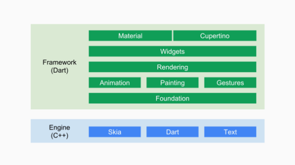

# 起步

## 移动开发技术简介

### 原生开发与跨平台技术

#### 原生开发

> 原生应用程序是指某一个移动平台所特有的应用，它使用相应平台支持的开发工具和语言，并直接调用系统提供的`SDK API`

1. 优势
   1. 可访问品台的全部功能（GPS、摄像头）；
   2. 速度快、性能高，可以实现复杂的动画效果及绘制，整体用户体验好。
2. 劣势
   1. 平台特定，开发成本高。不同平台必须维护不同的代码，人力成本随之增大；
   2. 内容固定，动态化弱，在大多数情况下，有功能更新时只能发新版本。

#### 跨平台技术简介

跨平台技术可以很好的解决原生开发面临的问题，根据其原理，主要可分为三类

1. H5 + 原生（Cordova、Ionic、微信小程序）
2. JavaScript 开发 + 原生渲染（React Native、Weex、快应用）
3. 自绘 UI + 原生（QT Mobile、Flutter）

#### 跨平台技术对比

|       技术类型        |    UI 渲染方式    | 性能 |     开发效率      |   动态化   |    框架代表    |
| :-------------------: | :---------------: | :--: | :---------------: | :--------: | :------------: |
|       H5 + 原生       |   WebView 渲染    | 一般 |        高         |    支持    | Cordova、Ionic |
| JavaScript + 原生渲染 |   原生控件渲染    |  好  |        中         |    支持    |    RN、Weex    |
|    自绘 UI + 原生     | 调用系统 API 渲染 |  好  | Flutter 高，QT 低 | 默认不支持 |  QT、Flutter   |

## 初识 Flutter

> Flutter 是 Google 推出并开源的移动应用开发框架，主要特点是**跨平台、高保真、高性能**，一套代码可以同时运行在 IOS 和 Android 平台上。

### 特点

- 跨平台自绘引擎

  Flutter 既不使用`WebView`，也不使用操作系统的原生控件。Flutter 使用自己的高性能渲染引擎来绘制`Widget`，保证在 Android 和 IOS 上 UI 的一致性，而且可以避免因对原生控件依赖而带来的限制及高昂的维护成本。

  Flutter 使用 `Skia` 作为 2D 渲染引擎。`Skia` 是一个 2D 图形处理函数库，包含字形、坐标转换，以及点阵图，且都有高效能且简洁的表现。`Skia` 是跨平台的，目前 Google Chrome 浏览器和 Android 均采用 `Skia` 作为其绘图引擎。

- 高性能

  Flutter 的高性能主要靠两点来保证：

  1. Flutter APP 采用 Dart 语言开发。
  2. Flutter 使用自己的渲染引擎绘制 UI，布局数据等有 Dart 语言直接控制，所以在布局过程中不需要想 RN 那样在 JavaScript 和 Native 之间通信。

- 采用 Dart 语言开发

  Dart 与 JavaScript 对比：

  1. 开发效率高
     1. 基于 `JIT` 的快速开发周期：Flutter 在开发阶段采用 `JIT` 模式，避免了每次改动都进行编译，节省开发时间
     2. 基于 `AOT` 的发布包：Flutter 在发布时通过 `AOT` 生成高效的 `ARM` 代码以保证应用的性能
  2. 高性能
  3. 快速分配内存
  4. 类型安全

**NOTE**：目前，程序主要有两种运行方式：`静态编译`与`动态编译`。静态编译的程序在执行前全部被翻译为机器码，通常将这种类型称为`AOT(Ahead Of Time)`，即“提前编译”；而解释执行的运行方式则是一句一句，边翻译边运行，称为`JIT(Just In Time)`，即“即时编译“。`JIT`和`AOT`指的是程序运行方式，与编程语言并不是强关联的，有些语言既可以以`JIT`的方式运行，也可以以`AOT`的方式运行，如`Java`、`Python`。

### 框架结构



自底向上：

1. `Flutter Engine`是一个纯 c++ 实现的 SDK，其中包括 Skia 引擎、Dart 运行时、文字排版引擎等。在代码调用`dart:ui`库时，最终会走到`Engine`层，然后实现真正的绘制逻辑。

2. 底下两层（`Foundation` 和 `Animation`，`Painting`，`Gestures`）合并为一个 Dart UI 层，对应的是 Flutter 中的 `dart:ui`包，它是 Flutter 引擎暴露的底层 UI 库，提供了动画、手势及绘制功能；

3. `Rendering`层，抽象的布局层，它依赖于 Dart UI 层，`Rendering`层会构建一个 UI 树，当 UI 树发生变化时，会计算出发生变化的那一部分，然后更新 UI 树，最终将 UI 树绘制到屏幕上。这个过程有些类似于 React 中的虚拟 DOM。`Rendering`层可以说是 Flutter UI 框架最核心的部分，它除了确定每个 UI 元素的位置、大小之外，还要进行坐标变换、绘制（调用底层`dart:ui`）。

4. `Widget`层是 Flutter 提供的一套基础组件库，在基础组件库之上，Flutter 还提供了 `Material` 和 `Cupertino`两种视觉风格的组件库。而**Flutter 开发的打多数场景，只是与这两层打交道**。

## Dart 语言简介

### 变量声明

- `var`

  可以接收任何类型的变量，但最大的不同之处是 Dart 中`var`变量一旦赋值，类型便会确定，即不能在改变其类型。

  ```dart
  var t;
  t = 'Hello World';
  // 下面的代码在Dart中会报错，因为变量类型已经确定为String
  t = 1000;
  ```

- `dynamic`和`Object`

  `Object`是 Dart 所有对象的基类，所有类型都是`Object`的子类（包括`Function`和`Null`），所以任何类型都可以赋值给`Object`声明的对象。

  `dynamic`和`Object`的相同之处在于，它们声明的变量可以在后期改变赋值类型。

  `dynamic`和`Object`不同之处在于，`dynamic`声明的对象，编译器会提供所有可能的组合，而`Object`声明的对象只会使用`Object`的属性与方法，否则编译器会报错。

  ```dart
  dynamic t;
  Object x;
  t = 'Hello World';
  x = 'Hello Object';

  // 下面的代码没有问题
  t = 1000;
  x = 1000;
  ```

- `final`和`const`

  `final`或`const`变量只能被设置一次，两者的区别在于：`const`变量是一个编译时常量，`final`变量则是在第一次使用时被初始化。

  `final`和`const`修饰的变量，其类型可以省略。

### 函数

Dart 中函数也是对象，可以赋值给变量或者作为参数传递给其他函数。

#### 命名参数

定义函数时，`{ param1, param2, ...}`指定命名参数，调用函数时，`paramName: value`指定明明参数：

```dart
// 定义函数
void enableFlags({bool bold, bool hidden}) {
  doSomething();
}

// 调用函数
enableFlags(bold: true, hidden: false);
```

命名参数**可选参数**，但是可以使用`@required`注解表面参数是必需的，用户必须提供这个参数：

```dart
void enableFlags({bool bold, @required bool hidden}) {
  doSomething();
}
```

要使用`@required`注解，需要导入`package:meta/meta.dart`包。

#### 位置参数

使用`[]`标记**可选**位置参数：

```dart
String say(String from ,String msg, [String device]) {
  var result = '$from says $msg';
  if (device != null) {
    return = '$result with a $device';
  }
  return result;
}

assert(say('Bob', 'Howdy') == 'Bob says Howdy');

assert(say('Bob', 'Howdy', 'smoke signal') == 'Bob says Howdy with a smoke signal');
```

#### 默认值

使用`=`给命名参数和位置参数定义默认值，默认值必须是*编译时常量*。如果不提供默认值，则默认值为`null`。

```dart
/// Sets the [bold] and [hidden] flags ...
void enableFlags({bool bold = false, bool hidden = false}) {
  doSomething();
}

// bold == true; hidden == false
enableFlags(bold: true);

// 位置参数设置默认值
String say(String from, String msg, [String device = 'carrier pigeon', String mood]) {
  var result = '$from says $msg';
  if (device != null) {
    result = '$result with a $device';
  }
  if (mood != null) {
    result = '$result (in a $mood mood)';
  }
  return result;
}

assert(say('Bob', 'Howdy') == 'Bob says Howdy with a carrier pigeon');

// List 或者 Map 作为默认值
void doStuff(
  {List<int> list = const [1, 2, 3],
  Map<String, String> gifts = const {
    'first': 'paper',
    'second': 'cottom',
    'third': 'leather'
  }}) {
  print('list: $list');
  print('gifts: $gifts');
}
```

#### `main()`方法

每个应用都应该有一个`main()`方法，它是整个应用的入口，`main()`函数接收一个可选的`List<String>`作为参数，并返回`void`。

命令行应用示例：

```dart
// 运行：dart args.dart 1 test
void main(List<String> arguments) {
  print(arguments);

  assert(arguments.length == 2);
  assert(int.parse(arguments[0]) == 1);
  assert(arguments[1] == 'test');
}
```

#### 函数作为“一等对象”

函数作为参数传递给另一个函数：

```dart
void printElement(int element) {
  print(element);
}

var list = [1, 2, 3];

// 作为参数传入函数
list.forEach(printElement);
```

赋值给变量：

```dart
var loudify = (msg) => '!!! ${msg.toUpperCase()} !!!';

assert(loudify('hello') == '!!! HELLO !!!');
```

#### 匿名函数

```dart
var list = ['apples', 'bananas', 'oranges'];

list.forEach((item) {
  print('${list.indexOf(item)}: $item');
})
```

函数体内只有一条语句时，可以使用箭头函数

```dart
list.forEach((item) => print('${list.indexOf(itme)}: $item'));
```

#### 词法作用域

Dart 的作用是静态决定的，与 JavaScript 一样，都是**词法作用域**，代码书写的位置决定作用域的位置。

```dart
bool topLevel = true;

void main() {
 	var insideMain = true;

  void myFunction() {
    var insideFunction = true;

    void nestedFunction() {
      var insideNestedFunction = true;

      assert(topLevel);
      assert(insideMain);
      assert(insideFunction);
      assert(insideNestedFunction);
    }
  }
}
```

`nestedFunction`可以访问每一层级的变量，一直到最顶层。

#### 词法闭包

闭包是一个函数对象，即使该函数在其原作用域之外调用，依然可以访问其词法作用域中的变量。

```dart
Function makeAdder(int addBy) {
  return (int i) => addBy + i;
}

void main() {
  var add2 = makeAdder(2);

  var add4 = makeAdder(4);

  assert(add2(3) == 5);
  assert(add4(3) == 7);
}
```

### 异步支持

Dart 有非常多返回`Future`或者`Stream`对象的函数。这些函数称为**异步函数**，它们在设置好一些耗时操作后返回（比如 I/O 操作），而不是等到这个操作完成。

`async`和`await`关键词支持异步编程，允许写出与同步代码类似的异步代码

#### Futures

要获取`Future`完成（或失败）的结果，有两种方式：

- 使用`async/await`；
- 使用`Future API`。

```dart
Future checkVersion() async {
  var version = await lookUpVersion();
}
```

使用`try`，`catch`和`final`做异常处理和清理工作：

```dart
try {
  version = await lookUpVersion();
} catch(e) {
  handleError();
}
```

常用的`Future API`:

- `Future.then`：异步操作成功时执行的回调，类比 JavaScript 中`promise.then`；
- `Future.catchError`：异步操作失败是时执行的回调，类比 JavaScript 中`promise.catch`；
- `Future.whenComplete`：无论异步操作执行成功与否都会执行的回调，类比 JavaScript 中`promise.final`；
- `Future.wait`：等待多个异步任务都执行结束，类比 JavaScript 中`promise.all`；

#### 声明`async`函数

`async`函数的函数体使用`async`修饰符标记：

```dart
Function<String> lookUpVersion() async => '1.0.0';
```

函数体重不需要使用`Future API`，Dart 会在必要的时候创建`Future Object`。如果函数不返回有用的值，返回值类型可以标记为`Future<void>`。

#### Streams

要从`Streams`中获取值，有两种方式：

- 使用`async`和`await for`（异步`for`循环）；
- 使用`Stream API`。

**NOTE**：使用`await for`之前要确保确实需要等待所有流的结果，比如，不应该在 UI 时间侦听器中使用`await for`，应为 UI 框架会无休止的发送事件流。

```dart
await for (varOrType identifier in expression) {
  // Execute each time the stream emits a value
}
```

`expression`的类型必须是`Stream`，执行流程如下：

1. 等待 stream 发射值；
2. 设置 `identifier` 为发射出来的值，并执行循环体；
3. 重复步骤 1 和 2 直到流关闭为止。

监听流：

```dart
querySelector('#submit').onClick.listen((e) {
  // when the button is clicked, it runs this code;
  submitdata();
})
```

流数据转换：

```dart
var lines = inputStream
  .transform(utf8.decoder)
  .transform(LinesSplitter());
```

异常处理：

```dart
Future readFileAwaitFor() async {
  var config = File('config.txt');
  Stream<List<int>> inputStream = config.openRead();

  var lines = inputStream
    .transform(utf8.decoder)
    .transform(LinesSplitter());

  try {
    await for (var line in lines) {
      print('Got ${line.length} characters from stream');
    }
    print('file is now closed')''
  } catch (e) {
    print(e);
  }
}
```

或者使用`Stream API`:

```dart
var config = File('config.txt');
Stream<List<int>> inputStream = config.openRead();

inputStream
  .transform(utf8.decoder)
  .transform(LineSplitter())
  .listen(
  	(String line) {
    	print('Got ${line.length} characters from stream');
	  },
  	onDone: () {
      print('file is now closed');
    },
  	onError: (e) {
      print(e);
    }
	);
```

更多信息查看[Dart 文档](https://dart.dev)
