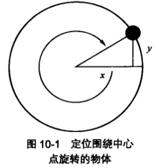
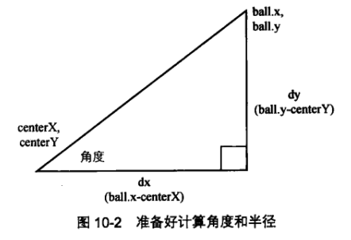
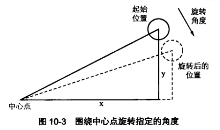
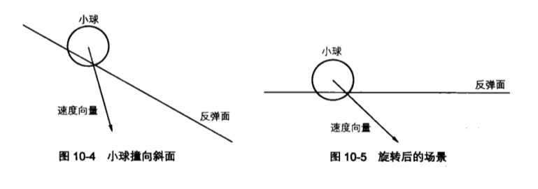
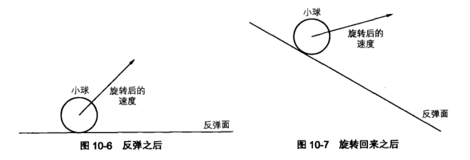

# 坐标旋转与斜面反弹

> 坐标旋转，顾名思义，就是说围绕某个点旋转坐标系。坐标旋转对于很多特效来说是必不可少的，比如，物体怎么从斜面上反弹

## 简单坐标旋转

假设有一个中心点、一个物体，还有半径(轨道)和角度(弧度制)。通过增减这个角度，用基本的三角函数计算位置，就能是物体围绕着中心点旋转。可以设置一个变量 vr(旋转速度)来控制角度的变化量：

```js
const vr = 0.1;
const angle = 0;
const raidus = 100;
const centerX = 0;
const centerY = 0;

function drawFrame() {
  window.rquestAnimateFrame(drawFrame);
  ctx.clearRect(0, 0, width, height);

  object.x = centerX + cos(angle) * radius;
  object.y = centerY + sin(angle) * radius;
  anglar += vr;
}
```

在每一帧中改变角度，并根据半径和角度使用三角函数计算物体的 x，y 位置。



当只知道物体的位置和中心点时，可以根据两个点计算出当前角度和半径，计算出来之后，代码就和前面一样了。

```js
const dx = ball.x - centerX;
const dy = ball.y - centerY;
const angle = Math.atan2(dy, dx);
const radius = Math.sqrt(dx ** 2 + dy ** 2);
```

这种旋转坐标的方法对于单个物体来说很合适，特别是角度和半径只需计算一次的情况。但是在更动态的例子里，可能需要旋转多个物体，而它们相对于中心点的位置各不相同。所以，在每一帧中，需要为每一个物体计算距离、角度和半径，然后把 vr 累加在角度上，最后计算新的 x，y 坐标。这既不是一个优雅的方案，也并高效。不过，幸运的是，我们还有其他更好的方法。



## 高级坐标旋转

物体围绕着一个点旋转且只知道它们的坐标是：

```js
x1 = x * cos(rotation) - y * sin(rotation);
y1 = y * cos(rotation) + x * sin(rotation);
```

更具体地说，是旋转物体相对于中心点的坐标，所以，也可以把公式写成这样：

```js
x1 = (x - centerX) * cos(rotation) - (y - centerY) * sin(rotation);
y1 = (y - centerY) * cos(rotation) + (x - centerX) * sin(rotation);
```

旋转(rotation)角度就是物体在这一步的旋转量，并不是当前角度，也不是旋转后的角度，而是两者的差值。换句话说，物体位于相对于中心点 45° 的位置，到达 50° 的位置。



将上面的公式分解开来，便于理解：

```js
x = radius * cos(angle);
y = radius * sin(angle);
x1 = radius * cos(angle + rotation);
y1 = radius * sin(angle + rotation);
```

两角之和的余弦值：

```js
cos(a + b) = cos(a) * cos(b) - sin(a) * sin(b);
```

两角之和的正弦值：

```js
sin(a + b) = sin(a) * cos(b) + cos(a) * sin(b);
```

所以把计算 x1 和 y1 的公式展开，得到：

```js
x1 = raidus * cos(angle) * cos(rotation) - radius * sin(angle) * sin(rotation);
y1 = radius * sin(angle) * cos(rotation) + radisu * cos(angle) * sin(rotation);
```

把上面的 x，y 变量带入公式，得到如下方程：

```js
x1 = x * cos(rotation) - y * sin(rotation);
y1 = y * cos(rotation) + x * sin(rotation);
```

### 旋转单个物体

```js
const ball = new Ball();
const vr = 0.05;
const center = {
  x: width / 2,
  y: height / 2
};

ball.x = Math.random() * width;
ball.y = Math.random() * height;

function drawFrame() {
  window.requestAnimationFrame(drawFrame);
  ctx.clearRect(0, 0, width, height);

  const x1 = ball.x - center.x;
  const y1 = ball.y - center.y;

  const x2 = x1 * Math.cos(vr) - y1 * Math.sin(vr);
  const y2 = y1 * Math.cos(vr) + x1 * Math.sin(vr);

  ball.x = center.x + x2;
  ball.y = center.y + y2;
  ball.draw(ctx);
}
```

根据小球相对于对于中心点(canvas 的中心点)的位置计算出 x1，y1。在用前面介绍的坐标旋转公式计算出小球旋转后的新位置 x2，y2。当然这也是相对于中心点的坐标，所以需要用 x2，y2 加上中心点的坐标才可以得小球真正的位置。

### 旋转多个物体

```js
const mouse = { x: 0, y: 0 };
const balls = [];
const numBalls = 10;
const vr = 0.05;
const center = { x: width / 2, y: height / 2 };
let cos = 0;
let sin = 0;

for (let i = 0; i < numBalls; i++) {
  const ball = new Ball();
  ball.x = Math.random() * width;
  ball.y = Math.random() * height;
  balls.push(ball);
}

function move(ball) {
  const x1 = ball.x - center.x;
  const y1 = ball.y - center.y;
  const x2 = x1 * cos - y1 * sin;
  const y2 = y1 * cos + x1 * sin;
  ball.x = center.x + x2;
  ball.y = center.y + y2;
}

function draw(ball) {
  ball.draw(ctx);
}

function drawFrame() {
  window.requestAnimationFrame(drawFrame);
  ctx.clearRect(0, 0, width, height);

  const angle = (mouse.x - center.x) * 0.0005;
  cos = Math.cos(angle);
  sin = Math.sin(angle);

  balls.forEach(move);
  balls.forEach(draw);
}

drawFrame();

window.addEventListener('mousemove', function(event) {
  mouse.x = event.pageX;
  mouse.y = event.pageY;
});
```

使用鼠标位置来控制多个小球的旋转速度。如果鼠标位置在 canvas 中间，那么小球静止不动，如果鼠标向左移动，小球就沿逆时针方向越转越快。如果鼠标向右移动，小球就沿顺时针越转越快。

## 斜面反弹

思路：旋转整个系统使反弹面水平，然后做反弹，最后在旋转回来。这意味着反弹面、物体的坐标位置和速度向量都旋转了。

旋转速度可能听起来很复杂，但是已经把速度存储在 vx 和 vy 变量中。vx 与 vy 确定了一个包括了角度和大小的向量。如果知道了角度，就可以直接旋转它。但是如果只知道 vx 和 vy，就可以使用高级坐标旋转公式得到同样的效果，就和旋转小球一样。





### 执行旋转

```js
const line = new Line(0, 0, 300, 0);
const ball = new Ball();
const gravity = 0.2;
const bounce = -0.6;

ball.x = width / 2 + 150;
ball.y = 100;

line.x = width / 2;
line.y = height / 2;
line.rotation = (10 * Math.PI) / 180;

const cos = Math.cos(line.rotation);
const sin = Math.sin(line.rotation);

function drawFrame() {
  window.requestAnimationFrame(drawFrame);
  ctx.clearRect(0, 0, width, height);

  ball.vy += gravity;
  ball.x += ball.vx;
  ball.y += ball.vy;

  let x1 = ball.x - line.x;
  let y1 = ball.y - line.y;
  // 旋转坐标
  let x2 = x1 * cos + y1 * sin;
  let y2 = y1 * cos - x1 * sin;
  // 旋转速度向量
  let vx1 = ball.vx * cos + ball.vy * sin;
  let vy1 = ball.vy * cos - ball.vx * sin;

  if (y2 > -ball.radius) {
    y2 = -ball.radius;
    vy1 *= bounce;
  }

  // 再旋转回来
  x1 = x2 * cos - y2 * sin;
  y1 = y2 * cos + x2 * sin;

  ball.vx = vx1 * cos - vy1 * sin;
  ball.vy = vy1 * cos + vx1 * sin;
  ball.x = line.x + x1;
  ball.y = line.y + y1;

  line.draw(ctx);
  ball.draw(ctx);
}
```

一开始，声明变量 `ball`、`line`、`gravity` 和 `bounce`。然后，初始化 `ball` 和 `line` 的位置，计算支线旋转角度的 `cos` 和 `sin` 值。接下来，在 `drawFrame` 函数中执行动画代码。

接下来，从小球的位置减去直线的位置，就会得到小球相对直线的位置。

现在，已经准备好执行旋转了！但是，当看到下面两行代码时，你可能会主要到它们是错误的：

```js
// rotate coordinates
x2 = x1 * cos + y1 * sin;
y2 = y1 * cos - x1 * sin;
```

加号和减号正好与前面介绍的坐标旋转公式相反，最初的坐标旋转公式如下：

```js
x1 = x * cos(rotation) - y * sin(rotation);
y1 = y * cos(rotation) + x * sin(rotation);
```

但这并不是一个错误，别忘了，我们要旋转直线使它成为一个水平面。如果直线的斜度是 10°，用原来的公式，你就把它有旋转了 10°，到了 20° —— 这是一个错误的方法！实际上，需要把它旋转 -10° 以达到水平位置。可以使用`Math.sin(-angle)`和`Math.cos(-angle)`来计算正余弦值。但是最终为了把整个熊旋转归为，还需要计算原始角度的正余弦值。

为了不使用两组正余弦变量(多出一倍的计算量)，可以使用另一种形式的坐标旋转 —— 反向旋转。如你看到的一样，只要简单地调换一下加减号即可。如果直线的角度为 10°，就把所有东西都旋转 -10°，让它变为 0°(水平)。速度的计算方法也一样。

不必旋转 line 实例，因为它只是用来让你看到反弹面的。而且它还是个保存斜面角度和位置的好地方。

接下来可以使用位置 x2，y2 和速度 vx1，vy1 来执行反弹了。因为 y2 是相对于 line 实例的位置，所以“底边”就是 line 自己，也就是 0。考虑到小球的大小，需要判断 y2 是否大于`0 - ball.radius`，就像这样：

```js
if (y2 > -ball.radius) {
  // do bounce
}
```

反弹其余部分应该是很简单的。

然后把所有东西都旋转归位，用最初的公式计算 x1，y1，ball.vx 以及 ball.vy 的值。要做的就是把 x1，y1 与 line.x，line.y 相加得到 ball 实例的绝对位置。

### 优化代码

把执行多次的代码缩减到只执行一次，或者压根不执行，除非你确定执行它们是必须的。

前一个例子的代码这么写是为了更清楚，其实还是有很多代码并不需要再每帧中都执行。许多代码仅在小球碰到直线后才需要执行。其余大多数时间，只需要执行基本的运动代码以及检测小球是否碰撞直线的代码。换句话说，只需要计算 if 语句：

```js
if (y2 > -ball.radius) {
  // do bounce
}
```

这里，需要用到变量 y2.为了得到它，需要知道 x1、y1、sin 和 cos。但是如果小球还没碰到直线，就不需要 x2 或 vx1 和 vy1，所以这些可以放进 if 语句块中。

同样，如果没有碰撞，就没必要把任何东西旋转归位，同样也没有必要重置小球的位置。所以碰撞后的所有代码也可以放进 if 语句块中。

## 重要公式

### 坐标旋转

```js
x1 = x * Math.cos(rotation) - y * Math.sin(rotation);
y1 = y * Math.cos(rotation) + x * Math.sin(rotation);
```

### 反向坐标旋转

```js
x1 = x * Math.cos(rotation) + y * Math.sin(rotation);
y1 = y * Math.cos(rotation) - x * Math.sin(rotation);
```
