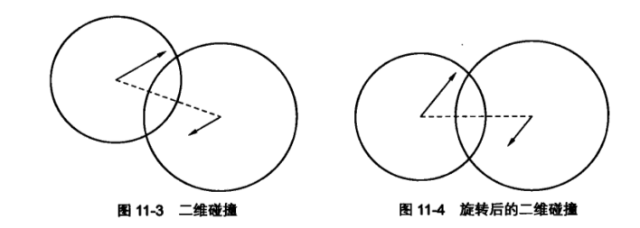
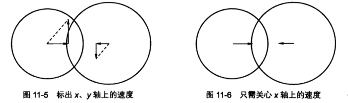
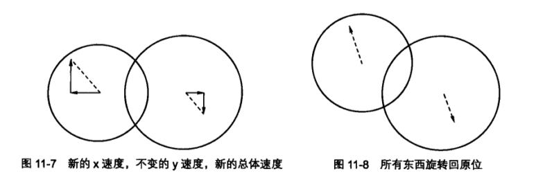

# 撞球物理

> 本章着重介绍动量：两个物体碰撞后动量如何变化，动量守恒原理，以及如何将动量守恒应用在动画中。

## 质量

严格意义上来说，质量是指物体保持运动速度的能力。因此，物体的质量越大，就越难以改变物体的运动状态。

质量与加速度、外力也有关系。物体的质量越大，就需要对它施加越大的外力来产生一定的加速度。用方程表示如下：

$$ F = m * a $$

## 动量

动量指物体的质量和速度的乘积。

$$ p = m * v $$

动量也是一个向量。动量向量的方向与速度向量的方向相同。

## 动量守恒

动量守恒是制作真是的碰撞效果的基本原理。

使用动量守恒原理，可以确定两个物体碰撞后如何反应。如果已知碰撞钱每个物体的质量以及速度大小和运动方向，就能计算出它们碰撞后的速度大小和运动方向。

动量守恒原理是一个基本的物理概念：系统在碰撞前的总动量等于系统在碰撞后的总动量。系统是指一些拥有动量的物体的集合，大多数情况下指的是一个封闭系统，也就是说不受外力影响。话句话说，可以忽略除了碰撞以外的任何因素。

动能公式：

$$ KE = 0.5m * v^2 $$

动能在碰撞前后也是相同的，所以：

$$ KE0 + KE1 = KE0Final + KE1Final $$

或者

$$ (0.5 * m0 * v0^2) + (0.5 * m1 * v1^2) = (0.5 * m0 * v0Final^2) + (0.5 * m1 * v1Final^2) $$

消去 0.5 得到：

$$ (m0 * v0^2) + (m1 * v1^2) = (m0 * v0Final^2) + (m1 * v1Final^2) $$

使用“代入消元法”可以得到计算两个未知数的公式：

$$ v0Final = \frac{(m0 - m1) * v0 + 2 * m1 * v1}{m0 + m1} $$

$$ v1Final = \frac{(m1 - m0) * v1 + 2 * m0 * v0}{m0 + m1} $$

### 单轴上的动量守恒

```js
const ball0 = new Ball();
ball0.mass = 2;
ball0.x = 50;
ball0.y = height / 2;
ball0.vx = 1;

const ball1 = new Ball();
ball1.mass = 1;
ball1.x = 300;
ball1.y = height / 2;
ball1.vx = -1;

function drawFrame() {
  window.requestAnimationFrame(drawFrame);
  ctx.clearRect(0, 0, width, height);

  ball0.x += ball0.vx;
  ball1.x += ball1.vx;

  const dist = ball1.x - ball0.x;

  if (Math.abs(dist) < ball0.radius + ball1.radius) {
    const vx0Final =
      ((ball0.mass - ball1.mass) * ball0.vx + 2 * ball1.mass * ball1.vx) /
      (ball0.mass + ball1.mass);

    const vx1Final =
      ((ball1.mass - ball0.mass) * ball1.vx + 2 * ball0.mass * ball0.vx) /
      (ball0.mass + ball1.mass);

    ball0.vx = vx0Final;
    ball1.vx = vx1Final;

    ball0.x += ball0.vx;
    ball1.y += ball1.vx;
  }

  ball0.draw(ctx);
  ball1.draw(ctx);
}
```

把 ball0 作为物体 0，ball1 作为物体 1，应用公式：

$$ v0Final = \frac{(m0 - m1) * v0 + 2 * m1 * v1}{m0 + m1} $$

代码如下：

```js
const v0Final =
  ((ball0.mass - ball1.mass) * ball0.vx + 2 * ball1.mass * ball1.vx) /
  (ball0.mass + ball1.mass);
```

同理，应用公式：

$$ v1Final = \frac{(m1 - m0) * v1 + 2 * m0 * v0}{m0 + m1} $$

求出 ball1 碰撞后的速度。即：

```js
const v1Final =
  ((ball1.mass - ball0.mass) * ball1.vx + 2 * ball0.mass * ball0.vx) /
  (ball0.mass + ball1.mass);
```

#### 调整物体位置

为了不让两个移动的物体嵌在一起，可以把一个小球的位置调整到另一个小球的边缘，但是无论移动哪个小球都会看起来像是跳跃一样不自然，在速度比较慢的时候尤其明显。

在本例中选用了一个简单的方案，就是把新速度加在物体位置上，再次让它们弹开，这个方法效果逼真，也十分简单。

#### 优化代码

本例中同样的方程(求物体碰撞后的速度)出现了两次，为了优化代码，需要消除一个：

- 首先需要得到两个物体的相对速度，这是它们的叠加总速度；
- 然后，计算出一个物体的最终速度后，在根据前面得到的相对速度，就可以计算出另一个物体的碰撞后的速度。

从整个系统的角度来考虑，用两个物体的速度**相减**就能得到相对速度。

在碰撞之前，以 ball1 的视角，用`ball0.vx - ball1.vx`来计算出总速度(相对速度)：

```js
const vxTotal = ball1.vx - ball0.vx;
```

然后在计算出 vx0Final 后，把它与 vxTotal 相加得到 vx1Final：

```js
const vx1Final = vxTotal + vx0Final;
```

### 双轴上的动量守恒

#### 理解原理和策略

二维空间中的碰撞，因为速度的方向完全不同，所以不能直接把速度代入动量守恒公式。



如同所示，二维空间中的碰撞，首先要计算两个小球位置形成的角度，并且逆时针旋转整个场景——位置和速度。比如，如果角度是 30°，就把所有东西旋转-30°。

两球间的角度很重要，这就是碰撞角度。



如上图所示，用向量箭头标出了两球的 vx 和 vy。两球的 vx 正好沿着碰撞的角度。

因为只需要关心碰撞角度上的那一部分速度 —— 现在就是 vx，所以可以忘了 vy。

然后使用动量公式计算得到两个新的 vx 值，vy 的值永远不变，但是 vx 的变化单独影响了总速度。

最后把所有东西都旋转会原位，得到每个球最终真是的 vx 和 vy。如下图所示：



#### 编写代码

基于距离的碰撞检测函数：

```js
function checkCollision(ball0, ball1) {
  const dx = ball1.x - ball0.x;
  const dy = ball1.y - ball0.y;
  const dist = Math.sqrt(dy ** 2 + dx ** 2);
  if (dist < ball0.radius + ball1.radius) {
    // collision handling code here
  }
}
```

碰撞处理代码首先需要计算两球之间的角度。计算出正弦和余弦并保存下俩，因为它们将会反复用到：

```js
const angle = Math.atan2(dy, dx);
const sin = Math.sin(angle);
const cos = Math.cos(angle);
```

然后，要对两个小球的速度和位置进行坐标旋转。旋转后的位置是 x0、y0、x1 和 y1，旋转后的速度为 vx0、vy0、vx1 和 vy1。

因为使用**ball0**作为“中心点”，所以它的坐标为(0, 0)。因为坐标旋转会后它也不变，所以：

```js
const x0 = 0;
const y0 = 0;
```

接下来，ball1 的位置与 ball0 的位置有关，这与刚才计算出的距离 dx 和 dy 相对应，所以可以旋转它们得到 ball1 旋转后的位置：

```js
const x1 = dx * cos + dy * sin;
const y1 = dy * cos - dx * sin;
```

旋转所有小球的速度：

```js
const vx0 = ball0.vx * cos + ball0.vy * sin;
const vy0 = ball0.vy * cos - ball0.vx * sin;
const vx1 = ball1.vx * cos + ball1.vy * sin;
const vx2 = ball1.vy * cos - ball1.vx * sin;
```

现在使用 vx0、ball0.mass 和 vx1、ball1.mass 执行一维的碰撞反应。在前面的一维例子中，有这样的代码：

```js
const vxTotal = ball0.vx - ball1.vx;
ball0.vx =
  ((ball0.mass - ball1.mass) * ball0.vx + 2 * ball1.mass * ball1.vx) /
  (ball0.mass + ball1.mass);
ball1.vx = vxTotal + ball0.vx;
```

重写这段代码：

```js
const vxTotal = vx0 - vx1;
const vx0 =
  ((ball0.mass - ball1.mass) * vx0 + 2 * ball1.mass * vx1) /
  (ball0.mass + ball1.mass);
const vx1 = vxTotal + vx0;
```

所有要做的就是用旋转后的 vx0 和 vx1 来替换 ball0.vx 和 ball1.vx。

既然得到了碰撞后的位置和速度，就把一切旋转归位。首先计算旋转归位后的位置：

```js
const x0Final = x0 * cos - y0 * sin;
const y0Final = y0 * cos + x0 * sin;
const x1Final = x1 * cos - y1 * sin;
const y1Final = y1 * cos + x1 * sin;
```

别忘了调换旋转方程中`+`和`-`的位置，因为现在是往反方向旋转。这些“最终”位置并不是真正的最终，它们相对于系统中心点，就是 ball0 的原始位置。需要把它们与 ball0 的位置相加来得到真正的坐标位置：

```js
ball1.x = ball0.x + x1Final;
ball1.y = ball0.y + y1Final;
ball0.x = ball0.x + x0Final;
ball0.y = ball0.y + y0Final;
```

最后把速度旋转归位，直接改变小球的 vx 和 vy 属性：

```js
ball0.vx = vx0 * cos - vy0 * sin;
ball0.vy = vy0 * cos + vx0 * sin;
ball1.vx = vx1 * cos - vy1 * sin;
ball1.vy = vy1 * cos + vx1 * sin;
```

#### 解决一个潜在问题

两个物体有可能卡在一起。这通常发生在有多个物体碰撞的拥挤环境中，当它们高速运动时情况为更糟：

假设屏幕上有三个小球 —— ball0、ball1 和 ball2，它们恰好里的很近：

- 程序依照三个小球的速度移动它们。
- 程序检测 ball0 和 ball1，ball0 和 ball2，发现它们并没有碰撞。
- 程序检测 ball1 和 ball2。因为它们发生了碰撞，所以它们的速度和位置都要重新计算，然后弹开。这恰好不小心让 ball1 和 ball0 接触上了。然而，这一组已经进行过检测了，所以就忽略它。
- 在下一轮循环中，程序依然按照它们的速度移动小球，这样有可能使得 ball0 和 ball1 更为靠近。
- 现在程序发现 ball0 和 ball1 碰撞了，他会重新计算两个小球的速度和位置，将它们分开，但是，因为它们已经发生了接触，所以这可能并不能真正地分开它们，它们就卡在一起了。

在`checkCollision`函数中，

```js
pos0.x += v0.x;
pos1.x += v1.x;
```

这里假设碰撞只是由两个小球自己的速度引起的，然后把它们新的速度加回去以分开它们。大多数情况下，这是对的。但是刚刚那个场景是例外。如果遇到了这个问题，就需要再移动之前更加演技地确保两个物体是分离的：

```js
const absV = Math.abs(v0.x) + Math.abs(v1.x);
const overlap = ball0.radius + ball1.radisu - Math.abs(pos0.x - pos1.x);
pos0.x += (v0.x / absV) * overlap;
pos1.x += (v1.x / absV) * overlap;
```

这可能不是数学中最精确的方法，但是它看起来工作得很好。它首先确定绝对速度(两个物体速度的绝对值之和)，接下来，它确定两个小球的重叠量，这通过总半径减去距离来活得。然后，根据每个小球速度和绝对速度的比例，把它们一开重叠量的一部分距离。最后的结果是两个小球刚刚接触，但是没有重叠。

## 本章重要公式

### 动量守恒的数学表达

$$ v_0Final = \frac{(m_0 - m_1) * v_0 + 2 * m_1 * v_1}{m_0 + m_1} $$

$$ v_1Final = \frac{(m_1 - m_0) * v_1 + 2 * m_0 * v_0}{m_0 + m_ 1} $$
