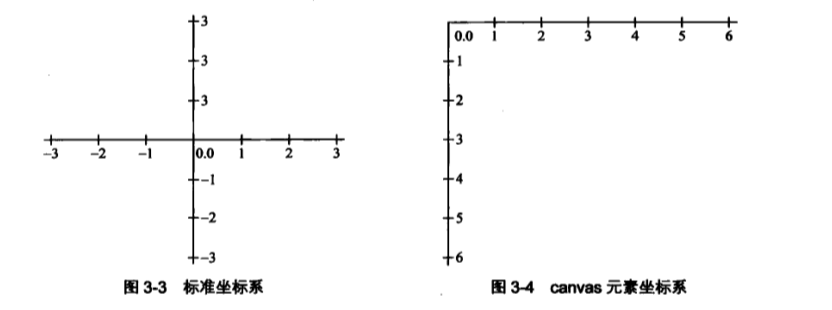
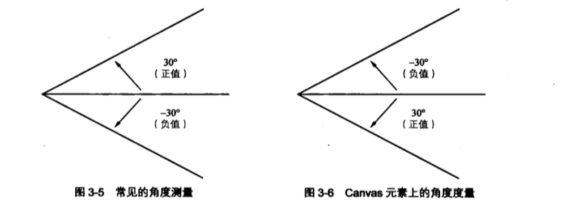
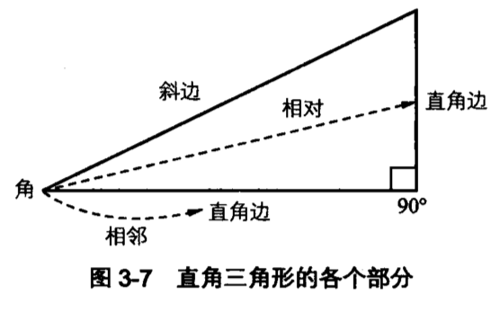
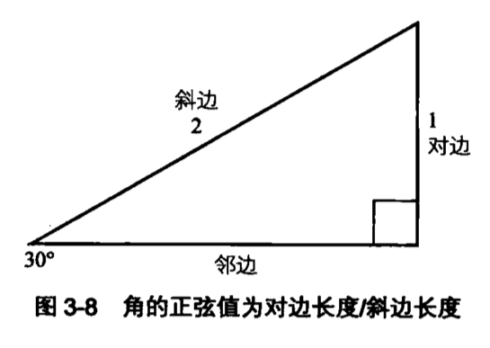
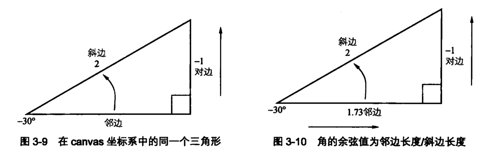
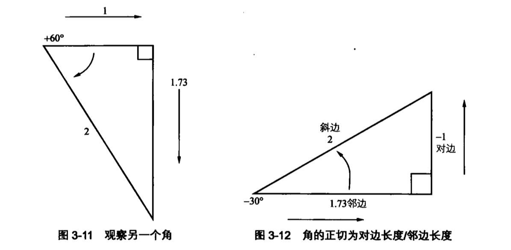
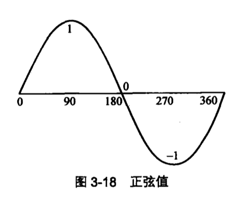
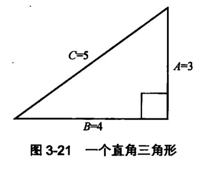
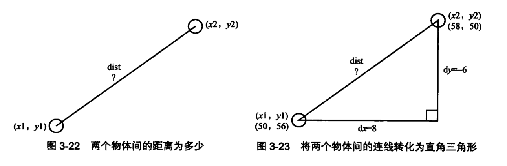

# 动画中的三角学

> 用于实现基本动画的 90% 的三角学知识都可以归结于两个函数: `Math.sin` 与 `Math.cos`。

## 三角学

三角学主要研究三角形以及它们的边角关系。

## 角

一个角是由两条相交线形成的形状或两条线之间的空间。空间越大，角的度数也就越高。

### 弧度和度数

角的度量单位分别有角度与弧度两大系统。但是，在衡量角的大小的时候，计算机更倾向于使用弧度的概念。

一弧度约等于 57.2958°。

360° 等于 6.2832 弧度等于 2pi

角度与弧度转化公式：

```js
radians = degrees * Math.PI / 180;
degrees radians * 180 / Math.PI
```

### canvas 坐标系

最常见的二维坐标系以 x 轴作为水平坐标，以 y 轴作为垂直坐标。

通常情况下(0, 0)坐标会显示在空间的正中心，随后 x 轴的坐标值向右以正数形式不断增大，向左以负数形式不断变小，而 y 轴的坐标值向上以正数形式不断增大，向下以负数形式不断变小。

而`canvas`元素却是基于视频画面的坐标系，其中(0, 0)处在空间的左上角，x 轴的坐标值从左往右不断增大，而 y 轴的坐标值向下以正数形式不但增大，向上以负数形式不断变小。因为电子枪是从左往右，从上往下扫描屏幕的。



在大多数系统中，角度的测量是以逆时针方向为正值的，0° 表示一个线沿着 x 轴正方向延伸。

`canvas`元素在这方面又显示了它的与众不同。在`canvas`元素中，顺时针的角度才是正值，逆时针的角度反而成了负值。

**NOTE:** 在`canvas`中角是从 x 正轴开始以逆时针方向计算的。



### 三角形的边



三角形最有趣的地方就在于其边角的大小关系，因为它们是相互影响的。这些关系对于动画起到了重要的作用。

### 三角函数

#### 正弦

一个角的**正弦**表示该角相对的**直角边**与**斜边**的比例。在 JavaScript 中，可以使用`Math.sin(angle)`函数。

```js
// 角度要转化为弧度
// radians = degrees * Math.PI / 180
// degrees = radians * 180 / Math.PI
Math.sin((30 * Math.PI) / 180);
```



#### 余弦

**余弦**表示角的**邻边**与**斜边**的比例。在 JavaScript 中，可以使用`Math.cos(angle)`函数。

```js
Math.cos((30 * Math.PI) / 180);
```



正弦、余弦只不过是一些边角关系和比率，而且它们是有联系的。

#### 正切

**正切**表示角的**对边**与**邻边**的关系。在 JavaScript 中，可以使用`Math.tan(angle)`函数。

```js
Math.tan((30 * Math.PI) / 180);
```



#### 反正弦与反余弦

简单来说，它们就是正弦与余弦的逆运算，换句话说，就是输入一个比率，获得对应的角的弧度。在 JavaScript 中分别使用函数`Math.asin(ratio)`与`Math.acos(ratio)`表示。

#### 反正切

反正切也就是正切的逆运算。输入角的对边与邻边的比率，通过计算反正切可以得到角的弧度。JavaScript 中提供了两个函数用于计算反正切：`Math.atan(ratio)`和`Math.atan2(y, x)`。

相对而言，`Math.atan2(y, x)`比`Math.atan(ratio)`更加重要。该函数接收两个参数：对边的长度与邻边的长度。大多数情况下，该长度为 x 轴或 y 轴的坐标。

## 旋转

绘制一个物体并让它随着鼠标旋转，使其总能指向鼠标。

**NOTE:** 当绘制任何图像并使其旋转时，请确保他指向了正确的或者正向的 x 轴坐标，因为此时的图像就是它旋转 0° 是的表象。

```js
// arrow.js
function Arrow() {
  this.x = 0;
  this.y = 0;
  this.color = '#ffff00';
  this.rotation = 0;
}

Arrow.prototype.draw = function(context) {
  context.save();
  context.translate(this.x, this.y);
  context.rotate(this.rotation);
  context.lineWidth = 2;
  context.fillStyle = this.color;
  context.beginPath();
  context.moveTo(-50, -25);
  context.lineTo(0, -25);
  context.lineTo(0, -50);
  context.lineTo(50, 0);
  context.lineTo(0, 50);
  context.lineTo(0, 25);
  context.lineTo(-50, 25);
  context.lineTo(-50, -25);
  context.closePath();
  context.fill();
  context.stroke();
  context.restore();
};

// index.js
const canvas = document.getElementById('canvas');
const context = canvas.getContext('2d');
const width = (canvas.width = window.innerWidth);
const height = (canvas.height = window.innerHeight);
const mouse = { x: 0, y: 0 };

const Arrow = window.__APP__.Arrow;
const arrow = new Arrow();

arrow.x = width / 2;
arrow.y = height / 2;

function drawFrame() {
  window.requestAnimationFrame(drawFrame);
  context.clearRect(0, 0, width, height);
  const dx = mouse.x - arrow.x;
  const dy = mouse.y - arrow.y;

  arrow.rotation = Math.atan2(dy, dx);
  arrow.draw(context);
}

window.requestAnimationFrame(drawFrame);

window.addEventListener('mousemove', function(event) {
  mouse.x = event.pageX;
  mouse.y = event.pageY;
});
```

## 波

正弦波实际上市正弦函数的结果所对应的的图像，输入参数涵盖了 0° 到 360°(或 0~2π 弧度)的所有值。从左到右是函数所接受的角度值(以弧度为单位)，y 轴则对应了这些角度的正弦值。



### 平滑的上下运动

使用`Math.sin(angle)`进行平滑的上下或前后移动。

```js
const canvas = document.getElementById('canvas');
const ctx = canvas.getContext('2d');
const width = (canvas.width = window.innerWidth);
const height = (canvas.height = window.innerHeight);
let angle = 0;

const ball = new Ball();
ball.x = width / 2;
ball.y = height / 2;

function drawFrame() {
  window.requestAnimationFrame(drawFrame);
  ctx.clearRect(0, 0, width, height);

  ball.y = height / 2 + Math.sin(angle) * 50;
  angle += 0.1;
  ball.draw(ctx);
}

window.requestAnimationFrame(drawFrame);
```

首先，需要创建一个`angle`属性并将其初始化为 0。在`drawFrame()`函数中，将`angle`属性的正弦值乘以 50 再加上`canvas`高度的一半，即为小球的运动范围。以此作为小球的 y 坐标，并在循环中以 0.1 弧度为步长不断增加`angle`属性的大小，这样就可以获得一个平滑的上线运动。

**NOTE:** 避免在动画代码中出现具体数字是一个很好的习惯，应该尽可能朝着这个方向努力。

### 线性垂直运动

```js
const canvas = document.getElementById('canvas');
const ctx = canvas.getContext('2d');
const width = (canvas.width = window.innerWidth);
const height = (canvas.height = window.innerHeight);
let angle = 0;
const centerY = 200;
const range = 50;
const xspeed = 1;
const yspeed = 0.05;
const ball = new Ball();

ball.x = 0;

function drawFrame() {
  window.requestAnimationFrame(drawFrame);
  ctx.clearRect(0, 0, width, height);

  ball.x += xspeed;
  ball.y = centerY / 2 + Math.sin(angle) * range;
  angle += yspeed;
  ball.draw(ctx);
}

drawFrame();
```

### 脉冲运动

```js
const canvas = document.getElementById('canvas');
const ctx = canvas.getContext('2d');
const width = (canvas.width = window.innerWidth);
const height = (canvas.height = window.innerHeight);
const centerScale = 1;
const range = 0.5;
const speed = 0.05;
let angle = 0;

const ball = new Ball();

ball.x = width / 2;
ball.y = height / 2;

function drawFrame() {
  window.requestAnimationFrame(drawFrame);
  ctx.clearRect(0, 0, width, height);

  ball.scaleX = ball.scaleY = centerScale + Math.sin(angle) * range;
  angle += speed;
  ball.draw(ctx);
}

window.requestAnimationFrame(drawFrame);
```

### 使用两个角的产生波

从单个角发展为两个角，并且为它们设置不同的中心点和速度。然后将其中一个角的正弦波应用于某个属性，再将另一个角的正弦波应用于另一个属性，比如，球形的位置和比例属性。

在以下示例中，一个角的正弦波用于影响球形的 x 轴坐标，另一个用于改变球形的 y 轴坐标。

```js
const canvas = document.getElementById('canvas');
const ctx = canvas.getContext('2d');
const width = (canvas.width = window.innerWidth);
const height = (canvas.height = window.innerHeight);

let angleX = 0;
let angleY = 0;
const range = 50;
const xspeed = 0.07;
const yspeed = 0.11;

const ball = new Ball();
ball.x = width / 2;
ball.y = width / 2;

function drawFrame() {
  window.requestAnimationFrame(drawFrame);
  ctx.clearRect(0, 0, width, height);

  ball.x = width / 2 + Math.sin(angleX) * range;
  ball.y = height / 2 + Math.sin(angleY) * range;
  angleX += xspeed;
  angleY += yspeed;
  ball.draw(ctx);
}

window.requestAnimationFrame(drawFrame);
```

### 使用绘图 API 产生的波

直接使用`canvas`的绘图 API 绘制正弦波而不再通过`Ball`对象。在`drawFrame`函数中取消了对`context.clearRect()`函数的调用，这样`canvas`元素就不会再每一帧开始的时候擦除之前绘制的图像，使得每一帧绘制的图像都会保留在`canvas`上。

```js
const canvas = document.getElementById('canvas');
const ctx = canvas.getContext('2d');
const width = (canvas.width = window.innerWidth);
const height = (canvas.height = window.innerHeight);

let angle = 0;
let xpos = 0;
let ypos = height / 2;
const range = 50;
const xspeed = 1;
const yspeed = 0.05;

ctx.lineWidth = 2;

function drawFrame() {
  window.requestAnimationFrame(drawFrame);

  ctx.beginPath();
  ctx.moveTo(xpos, ypos);
  // 计算下一帧位置
  xpos += xspeed;
  angle += yspeed;
  ypos = height / 2 + Math.sin(angle) * range;
  ctx.lineTo(xpos, ypos);
  ctx.closePath();
  ctx.stroke();
}
window.requestAnimationFrame(drawFrame);
```

## 圆与椭圆

**余弦波**的产生方式与正弦波是一样的，不过它是由余弦函数产生的而不是正弦函数。

### 圆周运动

如果只需要获得一个振荡运动，那么在所有情况下余弦和正弦是可以互换使用的。不过当余弦配合正弦使用时会获得一个更蝉蛹并更有价值的功能：让物体做圆周运动。

从侧面观察处于圆周运动的物体，实际上是在做上下运动。上下运动的中心点是圆心所在的位置，而上下运动的范围，则恰好是圆的半径。物体在运动中所处的位置为物体所处角度的正弦值与圆的半径的乘积。

再想象从圆的底部进行观察，则会发现物体在做前后运动。此时，在计算物体位置时应该计算三角形邻边的长度 x，因此使用余弦函数。

```js
const canvas = document.getElementById('canvas');
const width = (canvas.width = window.innerWidth);
const height = (canvas.height = window.innerHeight);

const ctx = canvas.getContext('2d');

let angle = 0;
const radius = 200;
const speed = 0.05;

const ball = new Ball();
ball.x = width / 2;
ball.y = height / 2;

function drawFrame() {
  window.requestAnimationFrame(drawFrame);
  ctx.clearRect(0, 0, width, height);

  ball.x = width / 2 + Math.cos(angle) * radius;
  ball.y = height / 2 + Math.sin(angle) * radius;
  angle += speed;
  ball.draw(ctx);
}

window.requestAnimationFrame(drawFrame);
```

**NOTE:** 以上代码使用余弦函数获得 x 坐标的大小，有通过正弦函数取得 y 坐标的大小。从牢记这一关系。在从事动画编程时，每当谈到 x 时，应立即想到余弦，谈到 y 时，应立即想到正弦。

### 椭圆运动

在圆周运动中，上下沿(y 轴)运动和前后沿(x 轴)运动的范围是一致的，正式这种情况下得到了一个完美的圆形。

当使用不同的半径来计算 x 与 y 的坐标位置时，就可以获得一个椭圆。

```js
const canvas = document.getElementById('canvas');
const width = (canvas.width = window.innerWidth);
const height = (canvas.height = window.innerHeight);

const ctx = canvas.getContext('2d');

let angle = 0;
const radiusX = 150;
const radiusY = 100;
const speed = 0.05;

const ball = new Ball();
ball.x = width / 2;
ball.y = height / 2;

function drawFrame() {
  window.requestAnimationFrame(drawFrame);
  ctx.clearRect(0, 0, width, height);

  ball.x = width / 2 + Math.cos(angle) * radiusX;
  ball.y = height / 2 + Math.sin(angle) * radiusY;
  angle += speed;

  ball.draw(ctx);
}

window.requestAnimationFrame(drawFrame);
```

上述代码中，`radiusX`为 150， 这意味着，球形在做圆周运动时以`canvas`坐标系原点为中心在前后 150 个像素的范围内运动。`radiusY`则设置为 100，这意味着，球形会在上下 100 个像素内做上下运动。

## 勾股定律

在直角三角形中，两条直角边的平方和等于斜边的平方。

$$ a^2 + b^2 = c^2 $$



在动画编程中，在已知两条直角边的长度的情况下，计算斜边长度是一个非常常见的应用场景。具体来说就是两点间的距离。

### 两点间的距离



上图中，dx 表示两个物体在 x 轴上的距离，而 dy 表示为它们在 y 轴上的距离。根据勾股定律，将两个值去平方后相加即可得到两个物体间的距离的平方，从而推导出两个物体之间的距离。

抽象成代码：

```js
const dx = x2 - x1;
const dy = y2 - y1;
const distance = Math.sqrt(dx ** 2 + dy ** 2);
```

**NOTE:** 勾股定律可以用于一种基于距离的冲突检测。也可以用于计算力(如重力或弹力)大小，因为两个物体间的引力跟它们之间的距离也存在一定的正比关系。

## 重要公式

### 三角学基础函数

- 正弦 = 直角边 / 斜边
- 余弦 = 邻边 / 斜边
- 正切 = 直角边 / 邻边

### 角度与弧度互转

```js
radians = (degrees * Math.PI) / 180;
degrees = (radians * 180) / Math.PI;
```

### 朝鼠标(或任意一点)旋转

```js
dx = mouse.x - object.x;
dy = mouse.y - object.y;
object.rotation = (Math.atan2(dy, dx) * 180) / Math.PI;
```

### 创建波

```js
(function drawFrame() {
  window.requestAnimationFrame(drawFrame);
  value = center + Math.sin(angle) * range;
  angle += speed;
})();
```

### 创建圆形

```js
(function drawFrame() {
  window.requestAnimationFrame(drawFrame);
  xposition = centerX + Math.cos(angle) * radius;
  yposition = centerY + Math.sin(angle) * radius;
  angle += speed;
})();
```

### 创建椭圆

```js
(function drawFrame() {
  window.requestAnimationFrame(drawFrame);
  xposition = centerX + Math.cos(angle) * radiusX;
  yposition = centerY + Math.sin(angle) * radiusY;
  angle += speed;
})();
```

### 获取两点间的距离

```js
const dx = x2 - x1;
const dy = y2 - y2;
const dist = Math.sqrt(dx ** 2 + dy ** 2);
```
