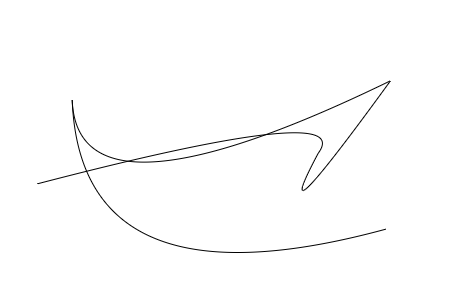

# 渲染技术

## canvas 上的颜色

使用 css 风格的字符串指定应用到`canvas`上的颜色，该字符串包含以下格式：

- `#RRGGBB`：十六进制格式，红绿蓝三原色的范围为 0~9、a~f。
- `#RGB`：简写的十六进制格式，转化成 6 位数字时重复三原色的值，而不是追加 0，如`#fb0`会转化为`#ffbb00`。
- `rgb(R, G, B)`：函数表达式，三原色分别有 0~255 的整数值表示。
- `rgba(R, G, B, A)`：包含透明度的函数表达式，与上一表达式类似，其中`alpha`参数由 0~1 的小数构成。需要制定透明度的颜色必须使用该格式。

一个 24 位的颜色值可以经由 0~16777215 之间的任意一个整数表示。

由于 256 由 8 位二进制数字表示，并且存在红绿蓝 3 中合成色， 8 乘以 3 等于 24，所以将这一系统称为 24 位颜色系统。此外，还有一个 32 位的颜色系统，其中用一个额外的 8 位数字表示颜色的透明度。

### 使用十六进制表示颜色值

每个合成色的值可以使 0~255 的任意数字，即十六进制中 0x00~0xFF 的任意数字。

比如在`0xFF55F3`这个十六进制表示的颜色值中，红色为`FF`，绿色为`55`， 蓝色为`F3`。观察这些数字，可以发现红色和蓝色的值偏大而绿色的值偏小。这样就可以大概猜到颜色偏紫色。

### 色彩合成

通过红绿蓝三原色的 3 个数值合成一个完整有效的颜色值，可以借助一下公式：

```js
color = (red << 16) | (green << 8) | blue;
```

其中`red`，`green`，`blue`分别代表 3 中颜色的变量，每个变量持有 0 ~255 之间的一个整数值。

### 提取三原色

从一种颜色中提取出每个独立的三原色的值：

```js
red = (color >> 16) & 0xff;
green = (color >> 8) & 0xff;
blud = color & 0xff;
```

### 透明度

想为`canvas`上的颜色设置透明度，就必须使用`rgba(R, G, B, A)`。

在获得每个单独的三原色后，必须将它们的值拼接成特定格式的字符串才能将颜色应用到`canvas`上。

```js
const red = 0xff;
const green = 0x55;
const blue = 0xf3;
const alpha = 0.2;
const color = `rgba(${red}, ${green}, ${blue}, ${alpha})`;
```

### 与颜色有关的工具函数

```js
// 接受一个表示颜色值的数字或十六进制字符串作为输入参数，
// 然后抽取出各个独立的三原色，并将它们拼接成一个css风格的函数作为返回值。
function colorToRGB(color, alpha = 1) {
  if (typeof color === 'string' && color[0] === '#') {
    color = Number.parseInt(color.slice(1), 16);
  }

  const red = (color >> 16) & 0xff;
  const green = (color >> 8) & 0xff;
  const blue = color & 0xff;
  const a = alpha < 0 ? 0 : alpha > 1 ? 1 : alpha;

  if (a === 1) {
    return `rgb(${red}, ${green}, ${blue})`;
  } else {
    return `rgba(${red}, ${green}, ${blue}, ${a})`;
  }
}

// 将一个颜色的数字值转换为一个十六进制格式的字符串，也可以将一个十六进制格式的字符串还原为一个数字值。
function parseColor(color, toNumber = false) {
  if (toNumber) {
    if (typeof color === 'number') {
      return color | 0; // 去掉小数位
    }
    if (typeof color === 'string' && color[0] === '#') {
      return Number.parseInt(color, 16);
    }
  } else {
    if (typeof color === 'number') {
      color = '#' + ('00000' + (color | 0).toString(16)).substr(-6);
    }
    return color;
  }
}
```

## 绘图 API

常用 API：

- strokeStyle
- fillStyle
- lineWidth
- save()
- restore()
- beginPath()
- closePath()
- stroke()
- lineTo(x, y)
- moveTo(x, y)
- quadraticCurveTo(cpx, cpy, x, y)
- bezierCurveTo(cp1x, cp1y, cp2x, cp2y, x, y)
- arcTo(x1, y1, x2, y3, radius)
- arc(x, y, radius, startAngle, endAngle [, anticlockwise])
- createLinearGradient(x0, y0, x1, y1)
- createRadialGradient(x0, y0, x1, y1, r1)
- clearRect(x, y, width, height)
- fillRect(x, y, width, height)

[canvas 规范](http://developers.whatwg.org/the-canvas-element.html)

## canvas 上下文

每个`canvas`元素都包含一个绘图上下文，通过它可以访问绘图 API

```js
const canvas = document.getElementById('canvas');
const context = canvas.getContext('2d');
```

## 使用`clearRect`消除图案

在大多数的动画中，必须在绘制下一帧图案前清除`canvas`，正是通过这一手段模拟出物体正在运动的效果。

`context.clearRect(x, y, width, height)`方法会通过将像素的颜色设置为全透明的黑色擦除指定区域内的每一个像素，从而清除指定的矩形区域。

```js
context.clearRect(0, 0, width, height);
```

**优化:** 如果能够确定某个动画只影响到帧的一个局部区域，那么可以在`clearRect`中指定一个稍小的矩形进而避免一些处理。另一个技巧是将多个`canvas`元素相互叠加。由于`canvas`是透明的，因此最终看到的会是它们组合而成的图像。如果在动画中有一整不变的背景图片，而又不想在每一帧中重复绘制它的化，就可以使用这一技巧。可以将这张背景图片作为一个背景`canvas`元素或`img`元素并在其上用另一个`canvas`绘制动画。

### 设置线条的外观

用于控制线条样式最常用的属性时颜色和宽度：

- `strokeStyle`: 该属性用于指定线条的颜色。该值可以是一个颜色值，一个渐变对象或者一个模式对象。线条默认颜色为黑色。
- `lineWidth`: 该属性用于指定线条在其路径上的宽度。因此当默认值为 1 时，该线条会在其路径的两侧分别延伸出半个像素。无法将线条绘制在其路径的内部或外部。该属性必须为正值。
- `lineCap`: 线条的终点将如何绘制，它可以使平的、圆形的或者一段延长线。该属性包含`butt`、`round`与`square`选项，默认值为`butt`。
- `lineJoin`: 决定两条相连线段如何接合，或者连接线的弯头部分如何绘制。该属性值包含`round`、`bevel`或`miter`选项，默认值为`miter`。
- `miterLimit`: 当`lineJoin`的属性设置为`miter`时，该属性可用于控制两条相交线外侧交点与内侧交点的距离。它必须是一个大于零的有限数，默认值为 10。

使用`context.save()`和`context.restore()`方法可以实现在不同的样式间切换。

## 使用`lineTo`与`moveTo`绘制路径

`canvas`绘图 API 采用的是`lineTo`命令，它会把七点和终点的信息保存在一个路径对象。

`canvas`上下文总是保持有一条唯一的当前路径。一条路径可以拥有零条或多条子路径，每条子路径由一系列通过直线或曲线相连的点构成。

如果一条路径的终点和起点间收尾相连，这条路径成为**闭合路径**。

调用`context.beginPath()`即可表示开始绘制一条新的路径。一条路径只不过是构成一条线的一系列坐标位置，为了将它们渲染到`canvas`上，需要调用`context.strokes()`方法。

在画完一条线后，这条线的终点将自动成为下一条线的起点。或者，可以使用`context.moveTo()`方法将下一条线指定一个新的起点。

### 使用`quadraticCurveTo`绘制曲线

`context.quadraticCurveTo(cpx, cpy, x, y)`方法通过一个控制点实现两点间的曲线连接。

该函数接受两个点作为参数：第一个点是控制点，用于决定影响曲线的形状，第二个点是曲线的终点。该形状由一个名为**贝塞尔曲线**的标准算法决定。

#### 穿过控制点的曲线

如果以(x0, y0)作为起点，(x2, y2)作为终点，(x1, y1)作为穿过曲线的控制点，(xt, yt)作为穿过曲线的点，那么控制点(x1, y1)的计算公式为：

```js
x1 = xt * 2 - (x0 + x2) / 2;
y1 = yt * 2 - (y0 + y2) / 2;
```

简单来说，就是将目标点的坐标乘以 2 再减去起点和终点的坐标的平均值。

### 创建多条曲线(完全没看懂)

错误示范：

```js
const canvas = document.getElementById('canvas');
const ctx = canvas.getContext('2d');
const points = [];
const numPoints = 9;
for (let i = 0; i < numPoints; i++) {
  points.push({
    x: Math.random() * canvas.width,
    y: Math.random() * canvas.height
  });
}
ctx.beginPath();
ctx.moveTo(points[0].x, points[0].y);

for (let i = 1; i < numPoints; i += 2) {
  ctx.quadraticCurveTo(
    points[i].x,
    points[i].y,
    points[i + 1].x,
    points[i + 1].y
  );
}
ctx.stroke();
```



该程序看上去合理，但是绘制出来的图像根本就不想一条平滑的曲线，而且在某些地方看上去还很尖锐。

它的问题在于：在连续的两条曲线间并没有协调好它们的走向，而只是简单地穿过了同一个点。

必须插入更多的点让它看上去更像曲线。方法如下：在每两个点之间，加入一个恰好位于它们中间的新点，并使用它们作为每条曲线的起点和终点，而将原始点作为曲线的控制点。

```js
const canvas = document.getElementById('canvas');
const ctx = canvas.getContext('2d');
const points = [];
const numPoints = 9;
const ctrlPoint = {};
for (let i = 0; i < numPoints; i++) {
  points.push({
    x: Math.random() * canvas.width,
    y: Math.random() * canvas.height
  });
}

ctx.beginPath();
ctx.moveTo(points[0].x, points[0].y);

let i = 1;
for (; i < numPoints - 2; i++) {
  ctrlPoint.x = (points[i].x + points[i + 1].x) / 2;
  ctrlPoint.y = (points[i].y + points[i + 1].y) / 2;
  ctx.quadraticCurveTo(points[i].x, points[i].y, ctrlPoint.x, ctrlPoint.y);
}
// 连接到最后一个点
ctx.quadraticCurveTo(
  points[i].x,
  points[i].y,
  points[i + 1].x,
  points[i + 1].y
);
ctx.stroke();
```

### 其他形式的曲线

- `bezierCurveTo(c1x, c1y, c2x, c2y, x, y)`: 增加一个到当前路径的点，并由三次贝塞尔曲线连接两个控制点。
- `arcTo(c1x, c1y, c2x, c2y, radius)`: 使用两个控制点和指定半径为连接到前一个点的直线路径添加一个弧度。
- `arc(x, y, radius, startAngle, endAngle[, anticlockwise])`: 为连接到前一个点的直线路径添加弧度，该弧度将以 x, y 为圆心， 以 radius 为半径的圆的一部分，该部分的起始角度和终止角度分别由 startAngle 和 endAngle 指定。

## 使用填充色创建图形

`context.fill()`方法会填充从起始点到当前位置中所有子路径构成的形状。

一般来说，绘图的顺序如下所示：

- beginPath;
- movetTo;
- lineStyle;
- fillStyle;
- 一系列 lineTo 与 quadraticCurveTo 方法或类似的曲线
- closePath 闭合图形;
- fill 图形的颜色;
- stroke 图形的轮廓;

如果在填充图形前没有将线条画回到起始点，当调用`context.fill()`方法时，`canvas`还是会填充图形，只不过不会关闭当前路径并绘制完整的轮廓。

### 创建渐变填充色

**渐变填充色**包含至少两种颜色。图形的一部分以一种颜色开始，然后渐渐地编程另一种颜色，在其变化过程中会经历一种或多种预定义的颜色。

#### 指定渐变类型

- 线性渐变： `createLinearGradient(x0, y0, x1, y1)`
- 放射性渐变：`createRadialGradient(x0, y0, r0, x1, y1, r1)`

### 设置渐变色的颜色

在设置颜色的同时，需要为每种颜色指定它们的位置，该值介于 0 ~ 1 的小数。每种颜色的这个位置值成为填充的**比例**。

**NOTE:** 渐变色的位置值不是表示像素值，而是与 1 的比率。

```js
const gradient = context.createLinearGradient(0, 0, 100, 100);
gradient.addColorStop(0, '#ffffff');
gradient.addColorStop(1, '#ff0000');
context.fillStyle = gradient;
context.fillRect(0, 0, 100, 100);
```

## 加载并绘制图片

在脚本运行过程中加载一个 URL 或使用 DOM 接口访问一个内嵌在 HTML 中的图片元素。当图片加载完成后，在使用绘图 API 将其渲染到`canvas`元素上。

### 加载图片

为了实现在运行时加载一张图片，可以创建一个`Image`对象并将其`src`属性设置为某个图片文件的 URL 路径。当图片加载完成后，就会执行其`onload`方法所关联的回调函数。

```js
const image = new Image();
image.src = 'picture.png';
image.onload = function() {
  context.drawImage(image, 0, 0);
};
```

`drawImage`的 3 中调用方式：

- `drawImage(image, dx, dy)`: 在`canvas`上的(dx, dy)坐标上绘制一张图片，(dx, dy)是图片左上角所在的位置。
- `drawImage(image, dx, dy, dw, dh)`: 分别分局 dw、dh 的值设定图片的宽度与高度，并将其绘制在`canvas`的(dx, dy)坐标。
- `drawImage(image, sx, sy, sw, sh, dx, dy, dw, dh)`: 将图片剪裁到矩形区域(sx, sy, sw, sh)中，并缩放至(dw, dh)，在将其绘制到(dx, dy)坐标。

### 使用图片元素

使用 DOM 接口访问 HTML 文件中的一个图片元素，该方法的优点在于在脚本执行时图片已经完全加载完成。当采用该方法是，记得使用 css 隐藏图片元素，否则可能会看到图片在文件中渲染两次。

```js
const image = document.getElementById('image');
context.drawImage(image, 0, 0);
```

### 使用视频元素

`canvas`支持逐帧视频渲染。

一段视频本质上就是按顺序播放的一系列静止的图像，因此`canvas`元素会在一个东环循环中不断绘制视频中的当前帧。

```js
const video = document.getElementById('movie');
function drawFrame() {
  window.requestAnimationFrame(drawFrame);
  context.drawImage(video, 0, 0);
}
window.requestAnimationFrame(drawFrame);
```

## 操纵像素

通过绘图 API 可以直接操纵组成`canvas`上图像的各个像素。可以创建、读取并写入像素数据，从而得以在 web 浏览器上创造出一些先进的视觉效果与动画。

### 获取像素数据

直接访问像素的功能是由`canvas`上下文中的`ImageData`对象提供的。

```js
const imageData = context.getImageData(x, y, width, height);
```

返回的对象包含 3 个属性： `width`、`height` 和 `data`。`width` 与 `height` 属性用于表示以像素为单位的图像大小，而 `data` 则是一个表示图像数据的数组。

创建空白的`ImageData`对象：

```js
const imageData = context.createImageData(width, height);
```

也可以为该方法传入另一个`ImageData`对象，即`context.createImageData(anotherImageData)`。此时会创建一个与传入参数相同大小的新对象，因为该方法并不会复制输入参数中的像素数据，所以新建对象中的像素为透明黑色。

#### 访问像素数据

`ImageData`对象的`data`属性返回一个一位数组，该数组包含构成像素颜色每个合成色的值，它们以 RGBA 的顺序出现在数组中，并通过 0 ~ 255 之间的整数表示。这些像素以从左到右，从上到下的顺序排列。

**NOTE:** `alpha`值也在 0 ~ 255 范围内，而不是 0.0 ~ 1.0

因为每个像素由数组中的 4 个元素表示，所以可以通过以下方式遍历图像数据中的像素点：

```js
for (let offset = 0; offset < pixels.length; offset += 4) {
  const red = pixels[offset]; // red
  const green = pixels[offset + 1]; //green
  const blue = pixels[offset + 2]; // blue
  const alpha = pixels[offset + 3]; // alpha
}
```

获取某个特定坐标像素在数组中的偏移量：

```js
const offset = (xpos + ypos * imageData.width) * 4;
```

### 绘制像素数据

`context.putImageData(imageData, x, y)`方法可以用将一个`ImageData`对象绘制到`canvas`上。其中参数 x、y 指定了所绘对象相对`canvas`左上角的坐标。

可以在图像数据数组中定位某个像素，并修改其三原色的值从而改变该像素的颜色。将更新后的像素值作为第一个参数传入`putImageData`方法，就可以将其重新绘制到`canvas`上。

清除图像中红色通道的值：

```js
const imageData = context.getImageData(0, 0, canvas.width, canvas.height);
const pixels = imageData.data;
for (let offset = 0; offset < pixels.length; offset += 4) {
  pixels[offset] = 0;
}

context.putImageData(imageData, 0, 0);
```

彩色图片转换为灰度图：

```js
for (let offset = 0; offset < pixels.length; offset += 4) {
  const r = pixels[offset];
  const g = pixels[offset + 1];
  const b = pixels[offset + 2];

  const luminance = 0.2126 * r + 0.7152 * g + 0.0722 * b;
  pixels[offset] = pixels[offset + 1] = pixels[offset + 2] = luminance;
}
```
