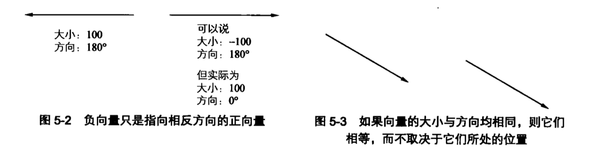
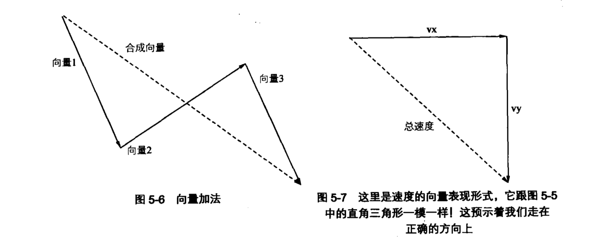

# 速度向量和加速度

> 基本的运动属性：速度、向量以及加速度。

## 速度向量

速度向量：**某个方向上**的速度。

速度向量的速度部分通常以每帧像素数来定义。换句话说，如果一个物体在义诊开始时候处在某个点，那么它的速度就是指在这帧结束时它距离开始那个点有多少个像素。

### 向量与速度向量

向量由大小和方向组成。在速度向量中，大小就是速度。

向量大小总是正数。即使一个向量的大小为负数也只是表示该向量指向一个相反的方向。

向量不包含任何位置信息。即使在速度向量中也没有说明物体运动的起点或终点，它仅仅之处运动的速度和方向。



### 单轴上的速度向量

把速度向量只放在一条轴上：x 轴(即水平运动)。就是让物体从屏幕左侧移动到右侧。

此时，物体的移动速就是每一帧它从左到右所移动的像素值。因此 v，如果速度向量在 x 轴上为 1，就意味着，物体在每一帧都会从左往右移动 1 个像素。同样，如果速度向量在 x 轴上为 -1，那么物体每一帧就会从右往左移动 1 个像素

所谓 -1 的速度向量实际上是大小为 1，方向为 180° 的速度向量。

为了便于理解，可以把负号看做是 x 轴上“向左”指示符，y 轴上“向右”指示符。

```js
const ctx = canvas.getContext('2d');
const ball = new Ball();
const vx = 1;
ball.x = width / 2;
ball.y = height / 2;

function drawFrame() {
  window.requestAnimationFrame(drawFrame);
  ctx.clearRect(0, 0, width, height);
  ball.x += vx;
  ball.draw(ctx);
}

window.requestAnimationFrame(drawFrame);
```

### 双轴上的速度向量

定义 vx 和 vy，并在每一帧中将 vx 的值增加到 x 属性上，vy 的增加到 y 属性上。这样，物体在每一帧中就会分别在 x 轴和 y 轴上移动若干像素。

```js
const ctx = canvas.getContext('2d');

const vx = 1;
const vy = 2;

const ball = new Ball();
ball.x = width / 2;
ball.y = height / 2;

function drawFrame() {
  window.requestAnimationFrame(drawFrame);
  ctx.clearRect(0, 0, width, height);

  ball.x += vx;
  ball.y += vy;
  ball.draw(ctx);
}

window.requestAnimationFrame(drawFrame);
```

### 角速度

```js
const angle = 45;
const speed = 1;

function drawFrame() {
  window.requestAnimationFrame(drawFrame);
  ctx.clearRect(0, 0, width, height);

  const radians = (angle * Math.PI) / 180;
  const vx = Math.cos(radians) * speed;
  const vy = Math.sin(radians) * speed;

  ball.x += vx;
  boll.y += vy;

  ball.draw(ctx);
}
```

### 向量加法

当向量相加时，只需将它们从头到尾依次相连，最终的合成向量就是那条从第一个向量的起点连接到最后一个向量的终点。

向量相加的结果与向量本身所处的位置以及时间无关。其结果就是物体以特定的速度和方向完成了一次运动。



### 速度向量扩展

尽管速度在狭义上是针对位置的迁移以及控件上的物理运动而言的，但是这并不代表它就一定要限制在物体的 x、y 轴坐标上。

一个绘制到`canvas`上的物体隐含了许多可供调整的属性，并且其中大多数属性都有比较大的取值范围，可以随着时间的变化而变化从而制作出动画效果。

比如，旋转一个物体，其中会在动画的每一帧中增加物体的`rotation`属性值，还有 alpha 速度向量(表示物体淡入淡出的快慢)。

## 加速度

加速度和速度向量有很多相似之处，它们都是向量，都是通过大小和方向描述。然而，速度向量改变的是物体的位置，而加速度改变的是其速度向量。

从代码角度来看，加速度就是**增加到**速度向量上的数值。

### 单轴加速度

```js
const ctx = canvas.getContext('2d');

let ax = 0.1;
let vx = 0;

const ball = new Ball();
ball.x = 0;
ball.y = height / 2;

function drawFrame() {
  window.requestAnimationFrame(drawFrame);
  ctx.clearRect(0, 0, width, height);

  vx += ax;
  ball.x += vx;

  ball.draw(ctx);
}

window.requestAnimationFrame(drawFrame);
```

### 双轴加速度

同时在 x，y 轴上设置加速度。

```js
const ctx = canvas.getContext('2d');

let ax = 0.1;
let ay = 0.2;
let vx = 0;
let vy = 0;

const ball = new Ball();

function drawFrame() {
  window.requestAnimationFrame(drawFrame);
  ctx.clearRect(0, 0, width, height);

  vx += ax;
  vy += ay;
  ball.x += vx;
  ball.y += vy;
  ball.draw(ctx);
}

window.requestAnimationFrame(drawFrame);
```

### 重力加速度

任何通过施加作用力导致物体速度变化的情况都是加速度的体现，包括重力、磁力、弹力、摩擦力等。

无论物体在什么位置，都可以放心地将重力定义在 y 轴方向上的一个加速度。

从代码角度来说，只需为重力给定一个数值并将其添加到球体在每一帧中的 vy 属性上。

如果以初始速度作为向量的起点，每个加速度、重力或者其他力都是天骄到这个速度向量的附加向量。将它们逐一相加后，绘制一条从起点到终点的直线，就得到了它们的合成向量，其结果与每个力在 x，y 轴上的分力的总和是相等的。

### 角加速度

```js
const ax = Math.cos(radians) * force;
const ay = Math.sin(radians) * force;
vx += ax;
vy += vy;
```

## 小结

理解加速度与速度的应用：

- 将已知的角速度分解为 x，y 轴上的速度向量；
- 将角角速度同样分解到 x，y 轴上；
- 分别将每条轴上的加速度与速度相加；
- 在分别将每条轴上的速度与物体的位置坐标相加。
