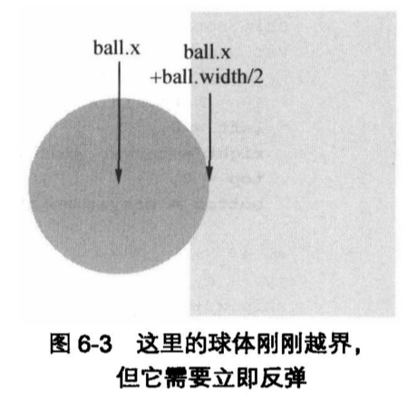

# 边界与摩擦力

## 环境边界

在`canvas`动画中，为物体设置一个空间。一般来说，它就是整个`canvas`元素，不过也可以将其设置为`canvas`的一部分。

### 设置边界

在大多数情况下，一个简单的巨型就可以构成一个边界。

```js
if (ball.x > canvas.width) {
  // do something
} else if (ball.x < 0) {
  // do something
}

if (ball.y > canvas.height) {
  // do something
} else if (ball.y < 0) {
  // do something
}
```

4 种物体越界处理方式：

- 将物体移除。
- 将物体置回边界内，就像产生了一个新的物体(重置对象)。
- 让同一个物体出现在边界内的另一个位置。
- 将物体反弹回边界内。

### 移除物体

如果物体会不断产生，那么移除物体的做法将非常有效。被移除的物体会被新近加入的对象所取代，这样`canvas`就永远不会为空。同时，边界内也不会有太多物体在移动，从而导致浏览器变慢。

将物体保存到一个数组中，通过遍历数组来移动物体，使用`Array.splice`方法移除某个物体。

### 重置物体

当一个物体移出`canvas`且不再需要是，重新的设定其位置，看上去就像创建了一个全新的对象。该方法可以为`canvas`源源不断地提供运动的物体，而又不用担心`canvas`上的物体过多已至于影响浏览器的速度，因为物体的数量是固定不变的。

该技术可用于创建喷泉或其他粒子特效，水滴不断地飞溅出来，飞出`canvas`后并重新加入到水流的源头。

### 屏幕环绕

思路：如果一个物体从屏幕右边移出，它就会在屏幕右边再次出现，反之亦然。

在屏幕环绕中一般不会改变物体的速度。

### 反弹

反弹方法需要检测物体何时离开屏幕，在它刚要离开时，要保持它的位置不变而仅改变它的速度向量。方法很简单：入托物体从屏幕的左边或右边越界，就对它的 x 轴速度向量取反，同理，如果物体从上方或者下方越界，就对它的 y 轴速度向量取反。

对单轴速度向量取反非常简单，只需将对应的值乘以-1 即可。

```js
vx *= -1;
vy *= -1;
```

在反弹方法的实现中，不能等物体完全移出`canvas`才开始反弹。首先要判断出物体的任何一部分超出边间的那个瞬间。而要做到这点，只需反过来减去或加上物体自身宽度或高度的一半。



当检测出物体在某个坐标轴方向上略微有点越界是，就需要立即对它在这条坐标轴的速度向量取反。除此之外，还要将物体的位置置回边界，这样才能造成撞击反弹的一个非常明显的视觉效果。

反弹的步骤：

- 检查物体是否越过任意边界；
- 如果发生越界，立即将物体置回边界；
- 反转物体的速度向量的发现。

## 摩擦力

摩擦力置回改变速度向量的大小而不会改变它的方向。换句话说，摩擦力只能将物体的速度降至零，但他无法让物体掉头向相反的方向移动。

### 摩擦力，正确方法

只能沿着速度向量的方向减去与摩擦力相等的大小，而不能分别在 x，y 轴上减小速度向量。

所以需要将**角速度**分解为速度和方向两部分。将 vx 与 vy 平方后求和，在开平方求出速度。在通过`Math.atan2(vy, vx)`获得角度。

```js
const speed = Math.sqrt(vx ** 2 + vy ** 2);
const angle = Math.atan2(vy, vx);
```

然后从速度部分中减去摩擦力，但是不要将速度变为负值，这样会逆转速度向量。如果摩擦力大于速度，则速度变为零。

```js
if (speed > friction) {
  speed -= friction;
} else {
  speed = 0;
}
```

此时，再通过正余弦函数将角速度转回 vx，vy 格式：

```js
vx = Math.cos(angle) * speed;
vy = Math.sin(angle) * speed;
```

### 摩擦力，简便方法

将 x，y 轴上的速度向量乘以一个百分数即可，一个接近 0.9 的系数就能够很好地模拟出摩擦力的效果。

从理论上来看，采用这一方法，速度向量会无限接近零，而永远不会等于零。不过，实际上计算机在表达小数时，只会精确到某个特定的精度，所以最终结果也会变为零。

这一方法的好处在于速度向量永远不会编程负数，所以无需做出任何条件判断，而且，x，y 轴的速度以同样的速率接近零，这样也就避免了在周速度与角速度之间的转换。

```js
vx *= friction;
vy *= friction;
```

**NOTE:** 不要局限在 x，y 轴的框框中，其实摩擦力可以应用到任何一个存在速度向量的地方。比如，在一个旋转的物体上应用摩擦力，会使其转速变慢并最终停止旋转。
