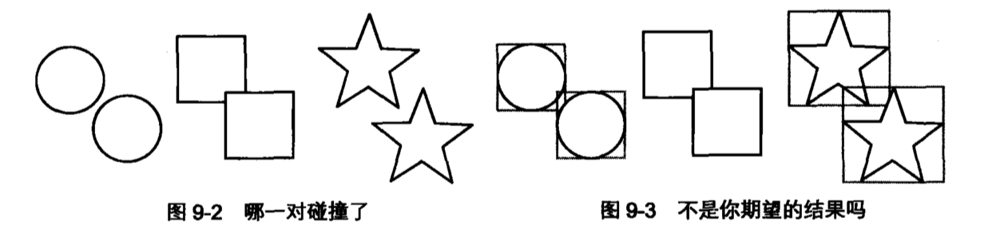
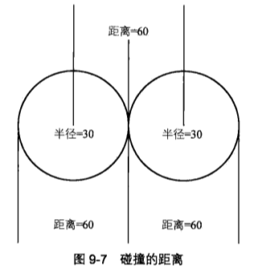
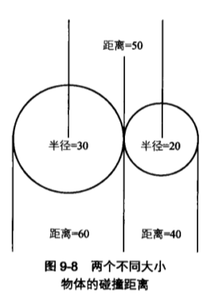
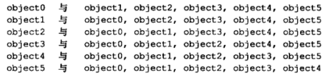
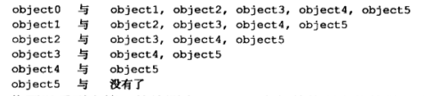

# 碰撞检测

## 碰撞检测的方法

碰撞检测就是判断两个物体是否在同一个时间内占用同一块控件。

几种检测碰撞的方法：

- 可以从几何图形的角度来检测，就是判断一个物体是否和另一个物体有重叠。用物体的矩形边界来判断。
- 也可以检测距离，就是判断两个物体是否足够近到发生碰撞。需要计算距离和判断两个物体是否足够近。

## 基于几何图形的碰撞检测

通过物体的矩形边界，检查它是否和其他矩形相交，或者某个坐标点是否落在矩形内。

```js
// 物体矩形边界
// 以球体为例
function getBounds(ball) {
  return {
    x: ball.x - ball.radius,
    y: ball.y - ball.radius,
    width: ball.radius * 2,
    height: ball.radisu * 2
  };
}
```

### 两个物体间的碰撞检测

```js
function intersects(rectA, rectB) {
  return !(
    rectA.x + rectA.width < rectB.x ||
    rectB.x + rectB.width < rectA.x ||
    rectA.y + rectA.height < rectB.y ||
    rectB.y + rectB.height < rectA.y
  );
}
```

检测两个矩形边界是否相交

```js
intersects(objA.getBounds(), objB.getBounds());
```

碰撞检测算法越简单，精度就越低。如果精度要求越高，算法就越复杂而且需要大量计算。



通过矩形边界检测碰撞时，矩形总是能够得到很精确的结果，但是图形越不规则，结果就越不精确。所以检测对象不是矩形时，就要谨慎地使用这种方法了。

### 物体和点的碰撞检测

```js
function containsPoint(rect, x, y) {
  return !(
    x < rect.x ||
    x > rect.x + rect.width ||
    y < rect.y ||
    y > rect.y + rect.height
  );
}
```

如果必须对不规则的图形做碰撞检测，一个较好的办法是吧负责图形分解为小的矩形，然后检测这些矩形。这样提高了精度，但是也增加了计算量，所以需要在两个这件找一个平衡点。更高效一些的办法是，首先只检测图形的边界框，仅在检测到碰撞后，在把图形分解成小的矩形，进行更高精度的检测。

## 基于距离的碰撞检测

使用物体间的距离来判断它们是否相撞。

基于距离的碰撞检测对于圆形来说很完美，但是对于除了圆形以外的其他图形，这种方法也不确定。

### 基于距离的简单碰撞检测





模式：碰撞距离就是一个球的半径加上另个球的半径。

### 弹性碰撞

如何高效地处理多个人对象碰撞的交互：

基本的想法是创建一个大球，叫做 centerBall，放在 canvas 中央。然后加入多个随机大小和随机速度的小球，让它们做匀速运动，遇到墙就反弹。在每一帧中使用基于距离的方法来检测小球和中央大球是否碰撞。如果发生了碰撞，则计算弹动目标点和两球间的最小距离来避免小球完全撞入大球。

上面的意思是，如果一个运动中的小球碰到了中央大球，就会弹回去。这通过在中央大球外设置目标点，然后让小球向目标点弹动来实现。一旦小球达到目标点，就不在继续碰撞，弹性运动就结束了，继续做匀速运动。

```js
const centerBall = new Ball(100, '#cccccc');
const balls = [];
let numBalls = 10;
const spring = 0.03;
const bounce = -1;

centerBall.x = width / 2;
centerBall.y = height / 2;

while (numBalls--) {
  const ball = new Ball(
    Math.random() * 40 + 5,
    `#${((Math.random() * 0xffffff) | 0).toString(16)}`
  );
  ball.x = Math.random() * width;
  ball.y = Math.random() * height;
  ball.vx = Math.random() * 6 - 3;
  ball.vy = Math.random() * 6 - 3;
  balls.push(ball);
}

function move(ball) {
  ball.x += ball.vx;
  ball.y += ball.vy;
  if (ball.x + ball.radius > width) {
    ball.x = width - ball.radius;
    ball.vx *= bounce;
  } else if (ball.x - ball.radius < 0) {
    ball.x = ball.radius;
    ball.vx *= bounce;
  }

  if (ball.y + ball.radius > height) {
    ball.y = height - ball.radius;
    ball.vy *= bounce;
  } else if (ball.y - ball.radius < 0) {
    ball.y = ball.radius;
    ball.vy *= bounce;
  }
}

function draw(ball) {
  const dx = ball.x - centerBall.x;
  const dy = ball.y - centerBall.y;
  const dist = Math.sqrt(dx ** 2 + dy ** 2);
  const minDist = ball.radius + centerBall.radius;
  if (dist < minDist) {
    const angle = Math.atan2(dy, dx);
    const tx = centerBall.x + Math.cos(angle) * minDist;
    const ty = centerBall.y + Math.sin(angle) * minDist;
    ball.vx += (tx - ball.x) * spring;
    ball.vy += (ty - ball.y) * spring;
  }
  ball.draw(ctx);
}

function drawFrame() {
  window.requestAnimationFrame(drawFrame);
  ctx.clearRect(0, 0, width, height);

  balls.forEach(move);
  balls.forEach(draw);
  centerBall.draw(ctx);
}
```

## 多物体的碰撞检测策略

### 基础的多物体碰撞检测

假设有 6 个物体，分别为 object0，object1，object2，object3，object4 和 object5，它们都是运动的。想要检测它们之间是否碰撞，首先想到的是双重循环：外层循环每次拿出一个物体，内层循环再把它依次与其他物体想比较。

```js
objects.forEach(function(objectA, i) {
  for (let j = 0; i < objects.length; j++) {
    const objectB = objects[j];
    if (hitTestObject(objectA, objectB)) {
      // do something
    }
  }
});
```

对于 6 个物体，测试循环了 36 次。看起来挺对的，不过这段代码有两个大问题。

首先，看第一次循环做了些什么：因为变量 i 和 j 都是 0，所以现在 objectA 和 objectB 都指向 object0。这以为这，再用同一个物体和它自己做碰撞检测，这是在浪费资源。在碰撞检测之前，用`objectA !== objectB`判断一下，或者简单地用`i !== j`也是一样的。

```js
objects.forEach(function(objectA, i) {
  for (let j = 0; i < objects.length; j++) {
    const objectB = objects[j];
    if (i !== j && hitTestObject(objectA, objectB)) {
      // do something
    }
  }
});
```

这样节省了 6 次碰撞检测，检测次数现在降到了 30 次，但还是太多。下面列出了这段代码做的每一次检测：



首先看第一行的第一次检测：object0 和 object1，然后看第二行的第一次检测：object1 和 object0，干了同样的事情！如果 object0 没碰上 object1，那么 object1 肯定也没碰上 object0。或者，如果 object0 碰上了 object1，那么 object1 肯定碰上了 object0。上面有很多类似的重复。如果去掉了重复的检测，应该是这样的：



可以看到在第一轮检测中，object0 会与其他所有物体做碰撞检测。因为其他几个物体没必要再与 object0 做检测了，所以在第二轮中，把 object0 去掉了，object1 和剩下的 4 个物体做碰撞检测，然后把 object1 从列表中去掉。到最后一轮是，只剩下 object5 了，因为其他物体都已经和它做过碰撞检测了，没必要再把它与其他物体做碰撞检测了。这次碰撞检测的次数下降到了 15 次。

```js
objects.forEach(function(objectA, i) {
  for (let j = i + 1; j < objects.length; j++) {
    const objectB = objects[j];
    if (hitTestObject(objectA, objectB)) {
      //  do something
    }
  }
});
```

内层循环的索引总是从外层索引加 1 开始，这是因为前面的物体已经检测过了，没必要再做一次检测，这样就减少了检测次数。

### 多物体弹动

修改[弹性碰撞](#弹性碰撞)的例子，实现多物体弹动

```js
const balls = [];
const numBalls = 10;
const bounce = -0.5;
const spring = 0.03;
const gravity = 0.1;

for (let i = 0; i < numBalls; i++) {
  const ball = new Ball(
    Math.random() * 30 + 20,
    `#${((Math.random() * 0xffffff) | 0).toString(16)}`
  );
  ball.x = Math.random() * width;
  ball.y = Math.random() * height;
  ball.vx = Math.random() * 6 - 3;
  ball.vy = Math.random() * 6 - 3;
  balls.push(ball);
}

function move(ball) {
  ball.vy += gravity;
  ball.x += ball.vx;
  ball.y += ball.vy;
  if (ball.x + ball.radius > width) {
    ball.x = width - ball.radius;
    ball.vx *= bounce;
  } else if (ball.x - ball.radius < 0) {
    ball.x = ball.radius;
    ball.vx *= bounce;
  }

  if (ball.y + ball.radius > height) {
    ball.y = height - ball.radius;
    ball.vy *= bounce;
  } else if (ball.x - ball.radius < 0) {
    ball.y = ball.radius;
    ball.vy *= bounce;
  }
}

function checkCollision(ballA, i) {
  for (let j = i + 1; j < numBalls; j++) {
    const ballB = balls[j];
    const dx = ballB.x - ballA.x;
    const dy = ballB.y - ballA.y;
    const dist = Math.sqrt(dx ** 2 + dy ** 2);
    const minDist = ballA.radius + ballB.radius;
    if (dist < minDist) {
      const angle = Math.atan2(dy, dx);
      const tx = ballA.x + Math.cos(angle) * minDist;
      const ty = ballA.y + Math.sign(angle) * minDist;
      const ax = (tx - ballB.x) * spring * 0.5;
      const ay = (ty - ballB.y) * spring * 0.5;
      ballA.vx -= ax;
      ballA.vy -= ay;
      ballB.vx += ax;
      ballB.vy += ay;
    }
  }
}

function draw(ball) {
  ball.draw(ctx);
}

function drawFrame() {
  window.requestAnimationFrame(drawFrame);
  ctx.clearRect(0, 0, width, height);

  balls.forEach(checkCollision);
  balls.forEach(move);
  balls.forEach(draw);
}
```

在`checkCollision`函数中检测 ballA 和 ballB 的碰撞。它和前面小球碰撞中央大球的例子本质上是一样。现在只不过是把 ballA 当做中央大球。

计算出两球间的角度，计算 ballB 目标点的 x，y，注意加上偏移量，以防两个球互相重叠。计算出 ballB 在 x 轴和 y 轴上的加速度 ax 和 ay，然后把加速度减半。

这里有个小技巧：在本例中，不仅 ballB 要从 ballA 弹开，而且 ballA 要从 ballB 弹开，它们加速度的绝对值相同，方向相反。所以加速度不比计算两次，只需要把 ax 和 ay 加载 ballB 的速度上，然后把它们从 ballA 的速度中减去就行。结果是一样的，不过避免了一次加速度的计算。这样会使最终加速度扩大一倍，为了抵消，在计算 ax 和 zy 的时候，给它们乘上 0.5，或在生命 spring 变量时，把它减半，设为 0.015，这样就可以避免两次乘法运算。

**NOTE：**以上我完全没看懂

说到优化技巧，这里还有一个：用`Math.atan2`预先计算角度，然后用`Math.cos`和`Math.sin`计算目标点坐标：

```js
const angle = Math.atan2(dy, dx);
const tx = ballA.x + Math.cos(angle) * minDist;
const ty = ballA.y + Math.sin(angle) * minDist;
```

但是别忘了，正弦是对边与斜边之比，余弦是邻边和斜边之比。因为这个角的对边是 dy，邻边是 dx，斜边是 dist。这样以上三行代码就缩减到两行：

```js
const tx = ballA.x + (dx / dist) * minDist;
const ty = ball.A.y + (dy / dist) * minDist;
```
