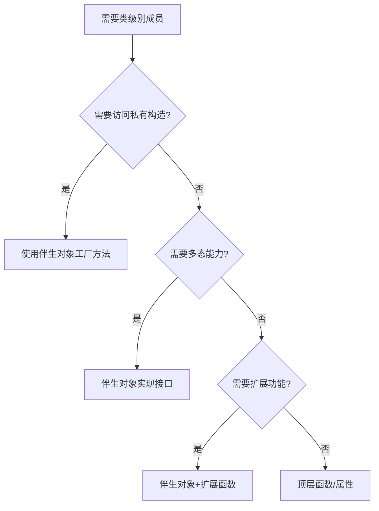

# 伴生对象

## 基础概念

### 定义

伴生对象（Companion Object）是**与类关联的单例对象**，使用 `companion object` 关键字声明：

```kotlin
class MyClass {
  companion object {
    const val TAG = "MyClass"
    
    fun create(): MyClass = MyClass()
  }
}
```

### 特性

| 特性       | 说明                                 |
| ---------- | ------------------------------------ |
| 单例性     | 每个类只能有一个伴生对象             |
| 类级别访问 | 无需实例化类即可访问                 |
| 命名灵活性 | 可以指定名称（默认名称 `Companion`） |
| 继承能力   | 可以实现接口，继承父类               |
| 内存分配   | 首次访问时初始化                     |

## 核心使用场景

### 工厂模式实现

```kotlin
class Connection private constructor(val url: String) {
  companion object Factory {
    private const val BASE_URL = "https://api.example.com"

    fun createDefault(): Connection {
      return Connection(BASE_URL)
    }

    fun createCustom(path: String): Connection {
      return Connection("$BASE_URL$path")
    }
  }
}

// 使用示例
val conn1 = Connection.createDefault();
val conn2 = Connection.createCustom("users")
```

### 定义常量

```kotlin
class DateUtils {
  companion object {
    const val MILLIS_PER_DAY = 86400000

    val SUPPORTED_FORMATS = listOf("yyyy-MM-dd", "dd/MM/yyyy")
  }
}

// 使用方式
val millis = DateUtils.MILLIS_PER_DAT
```

### 接口实现

```kotlin
interface JsonParser<T> {
  fun fromJSON(json: String): T
}

class User(val name: String) {
  companion object : JsonParser<User> {
    override fun fromJSON(json: String): User {
      // 解析 JSON 逻辑
      return User(parseName(json))
    }
  }
}

// 使用示例
val user = User.fromJSON("""{"name": "Alice"}""")
```

## 高级特性

### 伴生对象扩展

```kotlin
class Logger {
  companion object 
}

// 为伴生对象添加扩展函数
fun Logger.Companion.debug(message: String) {
  println("[DEBUG] $message")
}

// 调用方式
Logger.debug("系统初始化完成")
```

### JVM 静态互操作

```kotlin
class KotlinClass {
  companion object {
    @JvmStatic
    fun staticMethod() = println("静态方法")

    @JvmField
    val VERSION = "1.0.0"
  }
}

// Java 调用
KotlinClass.staticMethod(); // 等价于 Java 静态方法
String ver = KotlinClass.VERSION;
```

## 最佳实践指南

### 使用场景决策树



### 性能优化建议

#### 避免重型初始化

```kotlin
companion object {
  // 延迟初始化耗时资源
  val heavyResource by lazy { initHeavyResource() }
}
```

#### 谨慎使用 `@JvmStatic`

仅在需要 Java 互操作时添加，避免不必要的字节码生成

#### 常量优先使用 `const`

```kotlin
companion object {
  const val MAX_ITEMS = 100 // 编译时常量
}
```
