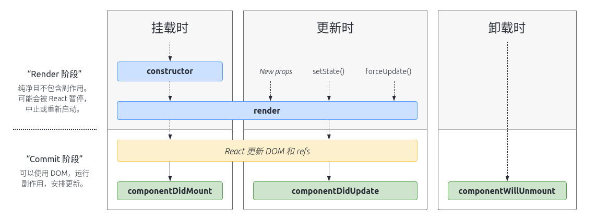
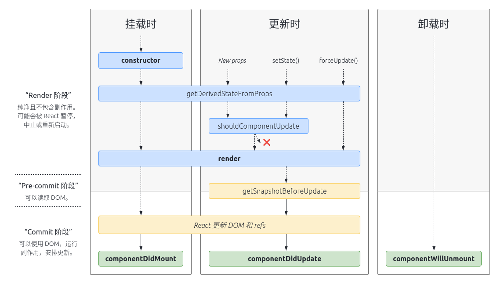

# React 入门

> A JavaScript library for building user interfaces

## 简介

React 是一个用于构建用户界面的**库**。它不仅仅局限于 web 开发，配合其他库（render）一起使用可以渲染到特定环境。比如 `React Dom` 用于 web 开发， `React Native` 用于构建移动端应用。甚至更进一步可以自己开发*渲染库*，渲染到自己需要的平台或者环境。

React 的主要目标是最大程度减少开发人员构建 UI 时发生的错误。通过使用组件来描述部分用户界面，通过将各部分组件组合在一起来构建完整的界面。

## 特点

### 声明式

**声明式编程**是一种编程范式，只需描述目标的性质，让计算机明白目标，而非流程。与之对应的是**命令式编程**。

在 React 中，为应用的每一个状态设计视图（界面）即可，具体的渲染，更新等过程由 React 来处理。

`UI = React(x)`

### 组件化

构建管理自身状态（state）的封装组件，然后对其组合以构成复杂的 UI。

### 一次学习，跨平台编写

无论你现在使用什么技术栈，在无需重写现有代码的前提下，通过引入 React 来开发新功能。

React 还可以使用 Node 进行服务器渲染，或使用 React Native 开发原生移动应用。

## 使用

### JSX

JSX 是一个 JavaScript 的语法扩展。用来更好的描述 UI。具备 JavaScript 全部的功能。

JSX 中可以嵌入任意 JavaScript 表达式，使得在描述 UI 时更具灵活性。

```jsx
// 基本使用
const name = '小明';
const element = <div>Hello, {name}</div>;

// 函数
const user = { firstName: 'Harry', lastName: 'Potter' };
function formatName(user) {
  return `${user.firstName} ${user.lastName}`;
}
const element = <div>Hello, {formatName(user)}</div>;

// 在 jsx 中指定属性
const user = { avatar: 'https://example.com/example.png' };
const element = ;
```

同时 JSX 也是一个 JavaScript 表达式，在经过编译后，JSX 表达式会被转为普通的 JavaScript 函数调用，其返回值是一个普通的 JavaScript 对象（在 React 中被成为 `React Element`）。

React Element 是构成 React 应用的最小单元，也就是大家熟知的（虚拟 DOM）。

```jsx
// 编译前
const element = <div>Hello World</div>;

// 编译后
const element = React.createElement('div', null, 'Hello World');

// React Element:
{
  $$typeof: Symbol(react.element),
  key: null,
  props: { children: 'Hello World' },
  ref: null,
  type: 'div',
}
```

### 组件

组件允许你将 UI 拆分为独立可复用的代码片段，并对每个片段进行独立构思。

在概念上，组件类似 JavaScript 函数。它接受任意的入参（props）， 并返回用于描述界面的 React 元素。

组件分为两种：

- 函数组件

  ```jsx
  function Hello(props) {
    return <div>Hello, {props.name}</div>;
  }
  ```

- class 组件

  ```jsx
  class Hello extends React.Component {
    render() {
      const { name } = this.props;
      return <div>Hello, {name}</div>;
    }
  }
  ```

函数组件和 class 组件是等效的。

组件定义好之后，需要渲染到对应环境，这就要用到渲染库。在 web 环境中就是 `React DOM` 库。一般只需要渲染根组件即可。

```jsx
function Hello(props) {
  return <div>Hello, {props.name}</div>;
}

// 根组件
// 通过组合不同组件构建复杂界面
function App() {
  return (
    <div>
      <Hello name="Harry Potter" />
      <Hello name="Amy" />
      <Hello name="xiaoming" />
    </div>
  );
}

// 渲染到浏览器
ReactDom.render(<App />, document.getElementById('root'));
```

### props

React 中使用 `props` 和 `state` 控制组件中的数据流。

`props` 是 `properties` 的简写，可以被定义为**一种数据从组件传递到组件的方式**。将数据从一个组件传递到另一个组件，使得组件更具灵活性和可复用性。

无论是*函数组件*还是*class 组件*，都不能修改自身的 `props`，相同入参，多次调用，始终返回相同的结果。

如果在组件内部修改了自身 `props`，React 在运行时也会报出对应的错误。

```jsx
function Tag(props) {
  return <div>{props.text}</div>;
}

class Label extends React.Component {
  render() {
    const { text } = this.props;
    return <div>{text}</div>;
  }
}

function App() {
  return (
    <div>
      <Label text="label" />
      <Tag text="React" />
    </div>
  );
}

ReactDom.render(<App />, document.getElementById('root'));
```

`props` 时**自顶向下**的**单向**数据流。这就意味着，`props` 必须从父组件传递到子组件，无法跳过，也无法从子组件反响传递到父组件。要想跨层级传递 `props`，就需要用到 React 中的另一个概念: `context`。

`props` 可以在定义的时候指定默认值，以防父组件没有向子组件传递对应属性，导致组件运行出错。（es6 特性）

```jsx
function Tag(props) {
  const { text = '' } = props;
  return <div>{text}</div>;
}

function Tag({ text = '' }) {
  return <div>{text}</div>;
}
```

为了 `props` 在传递时类型安全， React 提供了一个检查 `props` 类型的机制，配合 `prop-types` 库使用，最大程度减少因类型错误导致的异常。

```jsx
function Tag(props) {
  return <div>{props.text}</div>;
}

Tag.propTypes = {
  text: PropTypes.string,
};
```

而在 TypeScript 中，这一过程可以直接使用 `interface` 或者 `type` 实现。

```tsx
type TagProps = { text: string };

function Tag(props: TagProps) {
  return <div>{props.text}</div>;
}

const Tag = ({ text }: TagProps) => <div>{text}</div>;

class Tag extends React.Component<TagProps, {}> {
  render() {
    const { text } = this.props;
    return <div>{text}</div>;
  }
}
```

### state

`state` 和 `props` 类型，但是 `state` 是组件内部的私有状态，并且完全受控于组件。

```jsx
class Counter extends React.Component {
  state = { count: 0 };

  render() {
    const { count } = this.state;
    return <div>{count}</div>;
  }
}
```

在 hooks 出现之前， `state` 只能存在于 class 组件，函数组件是无法使用 `state` 的， hooks 赋予了函数组件使用
`state` 的能力。

```jsx
function Count() {
  const [count] = React.useState(0);
  return <div>{count}</div>;
}
```

关于 `state` 的使用要注意一下三点:

- 不能直接修改 `state` , class 组件使用 `setState` 函数修改， 函数组件使用对应的 `setXXX` 方法修改。

  ```jsx
  // class 组件
  class Counter extends React.Component {
    state = { count: 0 };

    handleClick = () => {
      this.setState((prevState) => ({ count: prevState.count + 1 }));
    };

    render() {
      const { count } = this.state;
      return (
        <div>
          <div>{count}</div>
          <button onClick={this.handleClick}>Click</button>
        </div>
      );
    }
  }

  // 函数组件
  function Counter() {
    const [count, setCount] = React.useState(0);

    const handleClick = () => {
      setCount(count + 1);
    };

    return (
      <div>
        <div>{count}</div>
        <button onClick={handleClick}>Click</button>
      </div>
    );
  }
  ```

- `state` 的更新可能是异步的

  处于性能考虑，React 可能将多个 `setState` 合并成一个进行调用，所以在更新状态时，直接使用 `this.state` 并不可靠。
  为了解决这个问题，在更新状态时，传递一个函数给 `setState` 作为参数。

  ```jsx
  // class 组件
  this.setState((prevState, prevProps) => ({ count: prevState.count + 1 }));

  // 函数组件
  setCount((prevState) => prevState.count + 1);
  ```

- `state` 的更新会被合并（仅限于 class 组件）

  React 会把 `setState` 函数返回的对象合并到当前对象中。

  ```jsx
  state = { count: 0, something: 'something' };

  this.setState((prevState) => ({ count: prevState.count + 1 }));

  // 更新后的 state
  {
    count: 1,
    something: 'something',
  }
  ```

  而在函数组件中，使用 `useState` 传入对象时，更新后的 state 会直接替换当前的 state，而不是合并。

  ```jsx
  const [state, setState] = React.useState({ count: 0, something: 'something' });

  setState((prevState) => ({ count: prevState.count + 1 }));

  // 更新后的state
  {
    count: 1;
  }
  ```

### 生命周期

每个组件（class 组件）都包含“生命周期方法”，开发过程中，可以重写这些方法，以便在运行特定阶段执行。





React 组件的生命周期分为三个部分。

#### 挂载

挂载过程主要包括组件实例的创建并插入 DOM 中。

- `constructor()`: 组件挂载之前，实例化组件对象

  构造函数仅用于以下两种情况：

  - 通过给`this.state`赋值对象来初始化内部`state`。
  - 为事件处理函数绑定实例。

- `static getDerivedStateFromProps()`: 返回一个对象来更新 state，返回 null 则不更新

  该函数使用率不高，而且可能会导致代码冗余，并使组件难以维护。如果 `state` 的值在任何时候都取决于 `props` 可以使用该方法来更新 `state`。

- `render()`: class 组件中唯一必须实现的方法，返回 React Element

  该函数必须为纯函数。

- `componentDidMount()`: 组件挂载后（插入到 DOM 树中）立即调用

  依赖于 DOM 节点的初始化都应该放在这里。

#### 更新

当组件的 `props` 或 `state` 发生变化时，会触发更新。

- `static getDerivedStateFromProps()`: 同挂载
- `shouldComponentUpdate()`: 更新时，决定组件是否重新渲染（UI 是否更新）

  当 `props` 或 `state` 发生变化时， `shouldComponentUpdate()` 会在渲染(`render()`)执行之前调用，如果返回 `false`， 则 React 跳过当前更新。

  一般用来作**性能优化**。

- `render()`: 同挂载
- `getSnapshotBeforeUpdate()`: 在最近一次渲染（提交到 DOM 节点）之前调用

  用来在组件更改之前从 DOM 中捕获一些信息，并作为 `componentDidUpdate(prevProps, prevState, snapshot)` 第三个参数。

- `componentDidUpdate()`: 更新完成后立即调用，首次渲染不会执行

  如果 `shouldComponentUpdate()`返回`false`，这不会调用`componentDidUpdate()`方法。

#### 卸载

- `componentWillUnmount()`: 在组件卸载及销毁之前直接调用

  可以在此方法中执行一些清除工作，比如定时器，事件绑定等。

### 事件绑定

React 元素的事件处理和 DOM 元素的很相似，但是有一点语法上的不同：

- React 事件的命名采用小驼峰式（camelCase），而不是纯小写。
- 使用 JSX 语法时你需要传入一个函数作为事件处理函数，而不是一个字符串。

传入事件处理函数的参数（event）是 React 根据 `W3C` 规范定义的合成事件，与原声事件不完全相同。具体可以参考[文档](https://reactjs.org/docs/events.html)。

```jsx
class Counter extends React.Component {
  constructor(props) {
    super(props);
    this.state = { count: 0 };
    // 绑定实例，在 javascript 中，class 的方法默认不绑定 this
    this.handleClick = this.handleClick.bind(this);
  }

  handleClick() {
    this.setState((prevState) => ({ count: prevState.count + 1 }));
  }

  render() {
    const { count } = this.state;
    return (
      <Fragment>
        <div>{count}</div>
        <button onClick={this.handleClick}>Click</button>
      </Fragment>
    );
  }
}

class Counter extends React.Component {
  state = { count: 0 };

  // 使用箭头函数，可以不用在 constructor 中绑定 this
  handleClick = () => {
    this.setState((prevState) => ({ count: prevState.count + 1 }));
  };

  render() {
    const { count } = this.state;
    return (
      <Fragment>
        <div>{count}</div>
        <button onClick={this.handleClick}>Click</button>
      </Fragment>
    );
  }
}

function Counter() {
  const [count, setCount] = useState(0);

  const handleClick = () => {
    setCount((prev) => prev + 1);
  };

  return (
    <Fragment>
      <div>{count}</div>
      <button onClick={handleClick}>Click</button>
    </Fragment>
  );
}
```

## 拓展链接

1. [React 文档](https://reactjs.org)
2. [TypeScript Cheat Sheets](https://github.com/typescript-cheatsheets/react)
3. [React Status](https://react.statuscode.com)
4. [In-depth explanation of state and props update in React](https://indepth.dev/posts/1009/in-depth-explanation-of-state-and-props-update-in-react)
