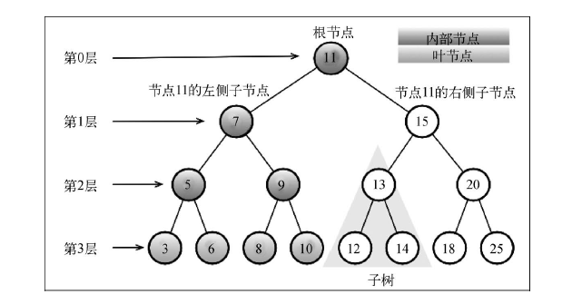
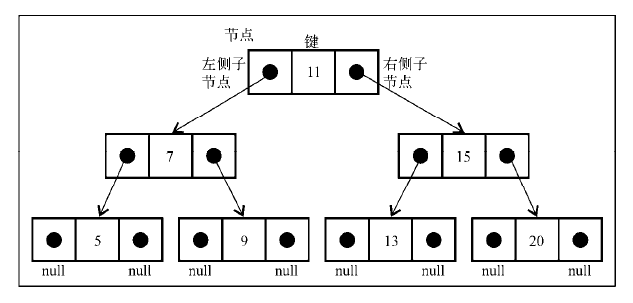

# 树

> 树，一种非顺序数据结构，对于存储需要快速查找的数据非常有用。

## 树数据结构

树是一种分层数据的先后向模型。如公司的组织架构图。


## 树的相关术语

一个树结构包含一系列存在父子关系的节点。每个节点都有一个父节点（除了顶部的第一个节点）以及零个或多个子节点。

根节点：位于树顶部的节点，没有父节点。

内部节点：存在父节点和子节点。

外部节点/叶节点：没有子元素的节点。

子树：由节点和它的后代构成。

节点深度：节点的深度取决于它的祖先节点数量。比如某节点有 3 个祖先节点，则该节点的深度为 3。

树的高度取决于所有节点深度的最大值。



## 二叉树和二叉搜索树

二叉树中的几点最多只能有两个：左侧节点和右侧节点。这些定义有助于写出更高效的向/从树种插入、查找和删除节点的算法。二叉树在计算机科学中应用非常广泛。

二叉搜索树（BST）是二叉树的一种，但是它只允许在左侧节点存储（比父节点）小的值，在右侧节点存储（比父节点）大（或者等于）的值。

### 创建`BinarySearchTree`类

和链表一样，通过指针来表示节点之间的关系（术语称其为**边**），每个节点包含两个指针，一个指向左侧子节点，另一个指向右侧子节点。

在树中，节点被称为**键**。



```js
function BinarySerachTree() {
  var Node = function(key) {
    this.key = key;
    this.left = null;
    this.right = null;
  }
  
  var root = null;
}
```

方法：

- `insert(key)`：向树中插入一个新的键；
- `search(key)`：在树中查找一个键，如果节点存在，则返回`true`，否则返回`false`；
- `inOrderTraverse`：中序遍历所有节点；
- `preOrderTraverse`：先序遍历所有节点；
- `postOrderTraverse`：后序遍历所有节点；
- `min`：返回树中最小的值/键；
- `max`：返回树中最大的值/键；
- `remove(key)`：从树中移除某个键。

### 向树中插入一个键

向树中插入一个新的节点（或顶），需要三步：

1. 创建用来表示新节点的`Node`类实例。只需要向构造函数中传递新节点的值，它的左指针和右指针的值会由构造函数自动设置为`null`；
2. 验证插入的节点是否为树的根节点，如果是，将根节点指向新节点；
3. 将节点加载非根节点的其他位置。

```js
this.insert = function(key) {
  var newNode = new Node(key);
  if (root === null) {
    root = newNode;
  } else {
    insertNode(root, newNode);
  }
}

var insertNode = function (node, newNode) {
  if (newNode.key < node.key) {
    if (node.left === null) {
      node.left = newNode;
    } else {
      insertNode(node.left, newNode)''
    }
  } else {
    if (node.right === null) {
      node.right = newNode;
    } else {
      insertNode(node.right, newNode);
    }
  }
}
```

`insertNode`函数实现步骤：

1. 如果新节点的键小于当前节点的键，检查当前节点的左侧子节点。如果没有左侧子节点，则插入新节点；否则递归调用`insertNode`方法继续找到树的下一层。
2. 如果新节点的键大于当前节点的键，检查当前节点的右侧子节点。如果没有右侧子节点，则插入新节点，否则递归调用`insertNode`方法继续找到树的下一层。