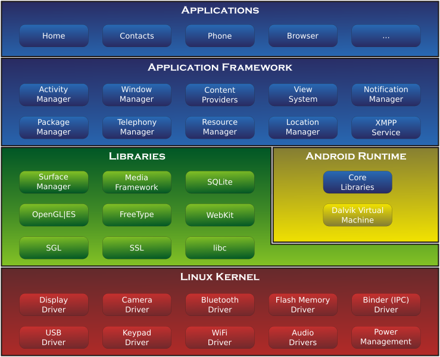

# 第一章

## Android 系统架构

Android 系统是基于 Linux 内核的，

### Linux 内核层

为 Android 设备硬件提供底层驱动，如显示、音频、相机、蓝牙、电源管理等。

### 系统运行库层

通过一些`C/C++`库为 Android 系统提供了主要的特性支持。如`SQLite`提供数据库支持，OpenGL|ES 库提供了 3D 绘图的支持，Webkit 库提供了浏览器内核的支持等。

Android 运行时库，主要提供了一些核心库，允许开发者使用 Java 语言来编写 Android 应用。同时运行时还包含了 Dalvik 虚拟机（5.0 系统之后改为 ART 运行环境），使每一个 Android 应用都能运行在独立的进程中，并且拥有一个自己的虚拟机实例。

Dalvik 和 ART 都是专门为移动设备定制的。

### 应用框架层

主要提供了构建应用程序时可能用到的各种 API，开发者可以使用这些 API 来构建自己的应用程序。

### 应用层

所有安装再手机上的应用程序都属于这一层。

## 系统架构图

## Android 应用开发特色

### 四大组件

1. Activity

   所有 Android 应用程序的门面，凡是在应用中看得到的东西，都时放在`Activity`中的。

2. Service

   运行在后台的服务。

3. BroadcastReceiver

   允许应用程序接收来自各处的广播详细，也可以向外发出广播消息。

4. ContentProvider

   应用程序之间共享数据。

### 丰富的系统控件

Android 系统为开发者提供了丰富的系统空间，可以轻松地编写出漂亮的界面。

### SQLite 数据库

轻量级、运算速度极快的嵌入式关系数据库，可以通过 Android 封装好的 API 进行操作，让存储和读取数据库变得非常方便。

### 强大的多媒体

Android 系统提供了丰富的多媒体服务，都可以在程序中通过代码进行控制。
