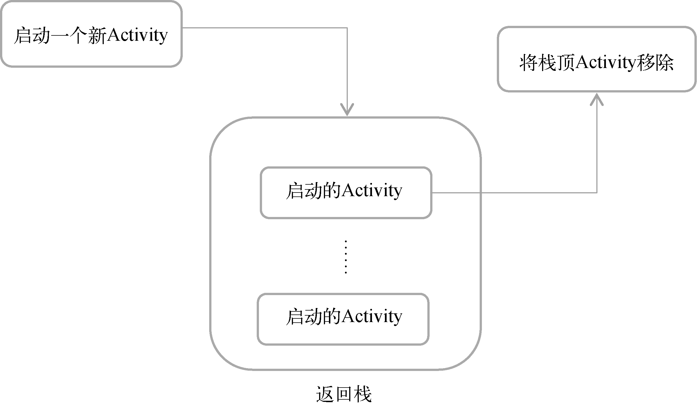

# 先从看得到的入手，探究 Activity

## Activity 是什么

Activity 是最容易吸引用户的地方，它是一种可以包含用户界面的组件，主要用于和用户进行交互。一个应用程序中可以包含零个或多个 Activity，但不包含任何 Activity 的应用程序很少见。

## Activity 的基本用法

### 手动创建 Activity

```kotlin
class FirstActivity: AppCompatActivity() {
  override fun onCreate(savedInstanceState: Bundle?) {
    super.onCreate(savedInstanceState)
  }
}
```

### 创建和加载布局

Android 程序的设计讲究逻辑和视图分离，最好每一个 Activity 都能对应一个布局。

布局是用来显示界面内容的。

加载布局：

```kotlin
class FirstActivity: AppCompatActivity() {
  override fun onCreate(savedInstanceState: Bundle?) {
    super.onCreate(savedInstanceState)
    // 给当前Activity加载一个布局
    setContentView(R.layout.first_layout)
  }
}
```

### 在 AndroidManifest 文件中注册

所有的 Activity 都要在 `AndroidManifest.xml` 中进行注册才能生效。

```xml
<?xml version="1.0" encoding="utf-8"?>
<manifest xmlns:android="http://schemas.android.com/apk/res/android"
    package="com.example.myfirstandroidapp">

    <application
        android:allowBackup="true"
        android:icon="@mipmap/ic_launcher"
        android:label="@string/app_name"
        android:roundIcon="@mipmap/ic_launcher_round"
        android:supportsRtl="true"
        android:theme="@style/Theme.MyFirstAndroidApp">
      	<!-- 注册 Activity -->
      	<!-- android:label 指定 Activity 中标题栏的内容，标题栏是显示在 Activity 最顶部的 -->
      	<!-- 主 Activity 指定的 label 不仅会成为标题栏中的内容，还会成为启动器（Launcher）中应用程序显示的名称 -->
        <activity
            android:name=".FirstActivity"
            android:label="This is FirstActivity">
          	<!-- 配置主 Activity -->
          	<!-- 主 Activity 是应用程序首先打开的 Activity -->
            <intent-filter>
                <action android:name="android.intent.action.MAIN" />
                <category android:name="android.intent.category.LAUNCHER" />
            </intent-filter>
        </activity>
    </application>

</manifest>
```

注册 Activity

```xml
<activity android:name=".PacakgeName" android:label="label" />
```

注册主 Activity

```xml
<activity android:name=".PackageName" android:label="label">
	<intent-filter>
  	<action android:name="android.intent.action.MAIN" />
    <category android:name="android.intent.category.LAUNCHER" />
  </intent-filter>
</activity>
```

没有主 Activity 的程序可以正常安装，但是无法在启动器（桌面）中看到或打开这个程序。这种程序一般是作为第三方服务供其他应用在内部进行调用的。

### 在 Activity 中使用 `Toast`

```kotlin
override fun onCreate(savedInstanceState: Bundle?) {
  super.onCreate(savedInstanceState)
  setContentView(R.layout.first_layout)
  val button1: Button = findViewById(R.id.button1)
  button1.setOnClickListener {
    Toast.makeText(this, "You clicked Button 1", Toast.LENGTH_SHORT).show()
  }
}
```

`findViewById()`方法获取在布局文件中定义的元素。通过传入在布局文件中定义的元素`id`(android:id)来得到元素示例。`findViewById()`方法返回的是一个继承自`View`的泛型对象，Kotlin 无法自动推到，需显示声明元素类型。

Kotlin 编写的 Android 项目在*app/build.gradle*文件的头部默认引入了一个`kotlin-android-extensions`插件，这个插件会根据布局文件中定义的控件`id`自动生成一个具有相同名称的变量，可以在 Activity 中直接使用这个变量，而不需要在调用`findViewById()`方法了。

#### view binding

[视图绑定](https://developer.android.com/topic/libraries/view-binding)

`kotlin-android-extensions` 已经被弃用，取而代之的时`视图绑定（view binding）`，大多数情况下会替代`findViewById`。

视图绑定功能可按模块启用，在`build.gradle`中设置：

```groovy
android {
  viewBinding {
    enable = true
  }
}
```

如果希望在生成绑定类时忽略某个布局文件，可在相应布局文件的根视图中添加`tools:viewBindingIgnore="true"`属性。

```xml
<LinearLayout tools:viewBindingIgnore="true"></LinearLayout>
```

为某个模块请用视图绑定功能后，系统会为该模块中包含的每个 XML 布局文件生成一个绑定类。每个绑定类均包含对根视图以及**具有 ID**的所有视图的引用。系统生成绑定类的名称规则：将 XML 文件的名称转换为驼峰式大小写，并在末尾添加”Binding“一词。如 `result_profile.xml`，对应的绑定类为`ResultProfileBinding"

在 Activity 中使用视图绑定：

1. 调用生成的绑定类中包含的静态`inflate()` 方法。此操作会创建该绑定类的实例供 Activity 使用。
2. 通过调用`getRoot()`方法或者[Kotlin 属性语法](https://kotlinlang.org/docs/reference/properties.html#declaring-properties)获取根视图的引用。
3. 将跟视图传递到`setContentView()`，使其成为屏幕上的活动视图。

```kotlin
class MainActivity:AppCompatActivity() {
  private lateinit var binding: ResultProfileBinding

  override fun onCreate(savedInstanceState: Bundle) {
    super.onCreate(savedInstanceState)
    binding = ResultProfileBinding.inflate(layoutInflater)
    val view = binding.root
    setContentView(view)
  }
}
```

使用绑定类来引用视图

```kotlin
binding.name.text = viewModel.name
binding.button.setOnClickListener { viewModel.userClicked() }
```

### 在 Activity 中使用 Menu

创建 Menu 资源文件

```xml
<menu xmlns:android="http://schemas.android.com/apk/res/android">
    <item
        android:id="@+id/add_item"
        android:title="Add"/>
    <item
        android:id="@+id/remove_item"
        android:title="Remove"/>
</menu>
```

重写 `onCreateOptionsMenu()`方法

```kotlin
override fun onCreateOptionsMenu(menu: Menu?): Boolean {
  menuInflater.inflate(R.menu.main, menu)
  return true
}
```

**NOTE:**

1. `menuInflater` 实际上式调用了父类的`getMenuInflater()`方法，得到一个`MenuInflater`对象，再调用`inflate()`方法，就可以给当前的 Activity 创建菜单了
2. `inflate()`方法接收两个参数：
   - 第一个参数用于指定通过哪一个资源文件创建菜单，
   - 第二个参数用于指定菜单项添加到哪一个 Menu 对象中。
3. `inflate()`方法返回`true`，表示允许创建的菜单显示出来，如果返回`false`,则创建的菜单将无法显示。

定义菜单响应事件：`onOptionsItemSelected()`

```kotlin
override fun onOptionsItemSelected(item: MenuItem): Boolean {
  when (item.itemId) {
    R.id.add_item -> Toast.makeText(this, "You clicked Add", Toast.LENGTH_SHORT).show()
    R.id.remove_item -> Toast.makeText(this, "You clicked Remove", Toast.LENGTH_SHORT).show()
  }
}
```

**NOTE:**
`item.itemId`实际调用的式`item.getItemId()`。

### 销毁一个 Activity

1. Back（返回键）销毁当前 Activity；
2. Activity 类提供的 `finish()` 方法来销毁当前的 Activity。

```kotlin
button.setOnClickListener {
  finish()
}
```

## 使用 Intent 再 Activity 之间穿梭

`Intent` 是 Android 程序中各组件之间进行交互的一种重要方式，不仅可以指明当前组件想要执行的动作，还可以再不同组件之间传递数据。

`Intent` 一般可用于启动 Activity、启动 Service 以及发送广播等场景。

### 显式 Intent

`Intent(Context packageContent, Class<?> cls)`

- `Context`：启动 Activity 的上下文；
- `Class`：指定想要启动的目标 Activity

通过显式 Intent 打开 Activity 的步骤：

1. 通过 `Intent(context, cls)` 构造出 intent；
2. 通过 `startActivity(intent)` 启动 Activity。

```kotlin
button.setOnClickListener {
  val intent = Intent(this, SecondActivity::class.java)
  startActivity(intent)
}
```

**NOTE:** `SecondActivity::class.java`的写法相当于 Java 中的`SecondActivity.class`的写法。

### 隐式 Intent

通过在 `<activity>` 标签下 `<intent-filter>` 中配置的当前 Activity 能够响应的 `action` 和 `category`，然后交由系统去分析 Intent，并找出合适的 Activity 去启动。

```xml
<activity android:name=".SecondActivity">
  <intent-filter>
    <action android:name="com.example.activity.ACTION_START" />
    <category android:name="android.intent.category.DEFAULT" />
  </intent-filter>
</activity>
```

只有`<action>`和`<category>`中的内容同时匹配 Intent 中指定的 `action` 和 `category`时，这个 Activity 才能响应 Intent。

```kotlin
button.setOnClickListener {
  val intent = Intent("com.example.activity.ACTION_START")
  startActivity(intent)
}
```

**NOTE:** `android.intent.category.DEFAULT` 是一种默认的 category,在调用`startActivity()`方法的时候会自动将这个 category 添加到 Intent 中。

每个 Intent 中只能指定一个 action，但是能够指定多个 category。

```kotlin
button.setOnClickListener {
  val intent = Intent("com.example.activity.ACTION_START")
  intent.addCategory("com.example.activity.MY_CATEGORY")
  startActivity(intent)
}
```

```xml
<activity android:name=".SecondActivity" >
    <intent-filter>
        <action android:name="com.example.activity.ACTION_START" />
        <category android:name="android.intent.category.DEFAULT" />
        <category android:name="com.example.activity.MY_CATEGORY"/>
    </intent-filter>
</activity>
```

### 启动其他程序的 Activity

隐式 Intent 不仅可以启动自己程序内的 Activity，还可以启动其他程序的 Activity，这就使多个应用程序之间的功能共享成为了可能。

使用隐式 Intent 打开浏览器:

```kotlin
button.setOnClickListener {
  val intent = Intent(Intent.ACTION_VIEW)
  intent.data = Uri.parse("https://baidu.com")
  startActivity(intent)
}
```

**NOTE:** `Intent.ACTION_VIEW` 是 Android 系统的内置的动作，其常量值为 `android.intent.action.VIEW`。

也可以在`<intent-filter>`标签中再配置一个`<data>`标签，用于更精确地指定当前 Activity 能够响应的数据：

- `android:scheme`：用于指定数据的协议部分；
- `android:host`：用于指定数据的主机部分；
- `android:port`：用于指定数据的端口部分；
- `android:path`：用于指定主机名和端口之后的部分；
- `android:mimeType`：用于指定可以处理的数据类型，允许使用通配符的方式进行指定。

只有当`<data>`标签中指定的内容和 Intent 中携带的 Data 完全一致时，当前 Activity 才能够响应该 Intent。

在 `<data>` 标签中一般不会指定过多的内容。

### 向下一个 Activity 传递数据

Intent 中提供了一些列 `putExtra()` 方法的重载，可以把想要传递的数据暂存在 Intent 中，在启动另一个 Activity 后，只需要把这些数据从 Intent 中取出就可以了。

```kotlin
button.setOnClickListener {
  val data = "Hello SecondActivity"
  val intent = Intent(this, SecondActivity::class.java)
  intent.putExtra("extra_data", data)
  startActivity(intent)
}
```

从 Intent 中取出数据

```kotlin
class SecondActivity: AppCompatActivity() {
  override fun onCreate(savedInstanceState: Bundle?) {
    super.onCreate(savedInstanceState)
    val binding = SecondLayoutBinding.inflate(layoutInflater)
    setContentView(binding.root)
    val extraData = intent.getStringExtra("extra_data")
    Log.d("SecondActivity", "extra data is $extraData")
  }
}
```

### [返回数据给上一个 Activity](https://developer.android.com/training/basics/intents/result)

虽然所有 API 级别的 `Activity` 类均提供底层 `starActivityForResult()` 和 `onActivityResult()` API，但强烈建议使用 AndroidX Activity 和 Fragment 中引入的 Activity Result API。

Activity Result API 提供了用于注册结果、启动结果以及在系统分派结果后对其进行处理的组件。

#### 针对 Activity 结果注册回调

在启动 Activity 以获取结果时，可能会出现进程和 Activity 因为内存不错而被销毁的情况，如使用相机等内存密集型操作。

Activity Result API 会将结果回调从之前启动另一个 Activity（FirstActivity）的代码位置分离开来。

`registerForActivityResult()` 接受 `ActivityResultContract` 和 `ActivityResultCallback` 作为参数，并返回 `ActivityResultLauncher` 来启动另一个 Activity。

```kotlin
val launcher = registerForActivityResult(GetContent()) { uri: Uri? -> }

override fun onCreate(savedInstanceState: Bundle？) {
  binding.button.setOnClickListener {
    launcher.launch("image/*")
  }
}
```

#### 在单独的类中接收 Activity 结果

直接使用 `ActivityResultRegistry` 在未实现的 `ActivityResultCaller` 的单独类中接收结果

```kotlin
class MyLifecycleObserver(private val registry: ActivityResultRegistry)
        : DefaultLifecycleObserver {

  lateinit var getContent: ActivityResultLauncher<String>

  override fun onCreate(owner: LifecycleOwner) {
    getContent = registry.registry("key", owner, GetContent()){ uri ->
      // Handle the returned Uri
    }
  }

  fun selectImage() {
    getContent.launch("image/*")
  }
 }

 class MyFragment: Fragment {
  lateinit var observer: MyLifecycleObserver

  override fun onCreate(savedInstanceState: Bundle?) {
    // ...


    observer = MyLifecycleObserver(requireActivity().activityResultRegistry)
    lifecycle.addObserver(observer)
  }

  override fun onViewCreated(view: View, savedInstanceState: Bundle?) {
    val button = view.findViewById<Button>(R.id.button)
    button.setOnClickListener {
      observer.selectImage()
    }
  }
 }
```

使用 ActivityResultRegistry API 时，强烈建议使用可接受 LifecycleOwner 作为参数的 API，因为 LifecycleOwner 会在 Lifecycle 被销毁时自动移除已注册的启动器。不过，如果 LifecycleOwner 不存在，每个 ActivityResultLauncher 类都允许您手动调用 unregister() 作为替代。

## Activity 的生命周期

### 返回栈

Android 中的 Activity 是可以层叠的。每启动一个新的 Activity，就会覆盖在原 Activity 之上，然后点击 Back 键会销毁最上面的 Activity，下面的一个 Activity 就会重新显示出来。

Android 是使用任务（task）来管理 Activity 的，一个任务就是一组存放在栈里的 Activity 的集合，这个栈也被乘坐返回栈（back stack）。



### Activity 状态

1. 运行状态

   当一个 Activity 位于返回栈的栈顶时，Activity 就处于运行状态。系统最不愿意回收的就是处于运行状态的 Activity，因为这会带来非常差的用户体验。

2. 暂停状态

   当一个 Activity 不再处于栈顶位置，但仍然可见时，Activity 就进入了暂停状态。并不是每一个 Activity 都会占满整个屏幕，不如对话框形式的 Activity 只会占用屏幕中的部分区域，对话框下面的 Activity 就是处于暂停状态的 Activity。只有在内存极低的情况下，系统才会去考虑回收这种 Activity。

3. 停止状态

   当一个 Activity 不再处于栈顶位置，并且完全不可见的时候，就进入了停止状态。系统仍然会为这种 Activity 保存相应的状态和成员变量，但是这并不是完全可靠的，当其他地方需要内存时，处于停滞状态的 Activity 有可能会被系统回收。

4. 销毁状态

   一个 Activity 从返回栈中移除后就变成了销毁状态。系统最倾向于回收处于这种状态的 Activity，以保证手机的内存充足。

### Activity 的生存期

1. `onCreate()`

   在 Activity 第一次被创建的时候调用。应该在这个方法中完成 Activity 的初始化操作，比如加载布局、绑定事件等。

2. `onStart()`

   在 Activity 由不可见变为可见的时候调用

3. `onResume()`

   在 Activity 准备好和用户进行交互的时候调用。此时的 Activity 一定位于返回栈的栈顶，并且处于陨星状态。

4. `onPause()`

   系统准备去启动或者恢复另一个 Activity 的时候调用。通常会在这个方法中将一些消耗 CPU 的资源释放掉，以及保存一些关键数据，但是这个方法的执行速度一定要快，不然会影响到新的栈顶 Activity 的使用。

5. `onStop()`

   在 Activity 完全不可见的时候调用。它和`onPause()`方法的主要区别在于，如果启动的新 Activity 时一个对话框式的 Activity，那么`onPause()`方法会得到执行，而`onStop()`方法并不会执行。

6. `onDestroy()`

   在 Activity 被销毁之前调用，之后 Activity 的 状态将变为销毁状态

7. `onRestart()`

   在 Activity 由停止状态变为运行状态之前调用。

以上 7 个方法可以将 Activity 分为一下 3 中生存期：

1. 完整生存期。Activity 在 `onCreate()`方法和`onDestroy()`方法之间所经历的就是完整的生存期。
2. 可见生存期。Activity 在 onStart()方法和 onStop()方法之间所经历的就是可见生存期。在可见生存期内，Activity 对于用户总是可见的，即便有可能无法和用户进行交互。
3. 前台生存期：Activity 在 onResume()方法和 onPause()方法之间所经历的就是前台生存期。在前台生存期内，Activity 总是处于运行状态，此时的 Activity 是可以和用户进行交互的，平时看到和接触最多的就是这个状态下的 Activity。


### Activity 被回收了怎么办

Activity 中还提供了一个 `onSaveInstanceState()` 回调方法，这个方法可以保证在 Activity 被回收之前一定会被调用。

`onSaveInstanceState()`方法会携带一个`Bundle`类型的参数，`Bundle`提供了一些列的方法用于保存数据，比如可以使用`putString()`方法保存字符串，使用`putInt()`方法保存整型数据。

```kotlin
override fun onSaveInstanceState(outState: Bundle) {
  super.onSaveInstanceState(outState)
  val tempData = "Something you just typed"
  outState.putString("data_key", tempData)
}
```

恢复保存的数据

```kotlin
override fun onCreate(savedInstanceState: Bundle?) {
  super.onCreate(savedInstanceState)
  Log.d(tag, "onCreate")
  setContentView(R.layout.activity_main)
  if (savedInstanceState != null) {
    val tempData = savedInstanceState.getString("data_key")
    Log.d(tag, "tempData is $tempData")
  }
}
```

Intent 可以结合 Bundle 一起用于传递数据。首先可以把需要传递的数据都保存在 Bundle 对象中，然后再将 Bundle 对象存放再 Intent 里。到了目标 Activity 之后，先从 Intent 中取出 Bundle，再从 Bundle 中一一取出数据。

## Activity 的启动模式

可以在`AndroidManifest.xml`文件中通过给`<activity>`标签指定`android:launchMode`属性来选择启动模式。

### standard

standard 是 Activity 默认的启动方式，在不显式指定的情况下，所有 Activity 都会自动使用这种启动模式。

在 standard 模式下，每当启动一个新的 Activity，它就会在返回栈中入栈，并处于栈顶的位置。对于使用 standard 模式的 Activity，系统不会在乎这个 Activity 是否已经在返回栈中存在，每次启动都会创建一个该 Activity 的新实例。


### singleTop

在 singleTop 模式下，启动 Activity 时如果发现返回栈的栈顶已经是该 Activity，则认为可以直接使用它，不会再创建新的 Activity 实例。


### singleTask

在 singleTask 模式下，每次启动该 Activity 时，系统首先会在返回栈中检查是否存在该 Activity 的实例，如果发现已经存在则直接使用该实例，并把在这个 Activity 之上的所有其他 Activity 统统出栈，如果没有发现就会创建一个新的 Activity 实例。


### singleInstance

在 singleInstance 模式下，Activity 会启用一个新的返回栈来管理这个 Activity。在这种模式下，会有一个单独的返回栈来管理这个 Activity，不管是哪个应用程序来方位这个 Activity，都公用一个返回栈，也就解决了共享 Activity 实例的问题。


## Activity 的最佳实践

### 随时随地退出程序

只需要用一个专门的集合对所有的 Activity 进行管理就可以了。

```kotlin
// 单例类
object ActivityCollector {
  private val activities = ArrayList<Activity>()

  fun addActivity(activity: Activity) {
    activities.add(activity)
  }

  fun removeActivity(activity: Activity) {
    activities.remove(activity)
  }

  fun finishAll() {
    for (activity in activities) {
      if (!activity.isFinishing) {
        activity.finish()
      }
    }
    activities.clear()
  }
}
```

### 启动 Activity 的最佳写法

```kotlin
class SecondActivity: BaseActivity() {
  companion object {
    fun actionStart(context: Context, data1: String, data2: String) {
      val intent = Intent(context, SecondActivity::class.java)
      intent.putExtra("param1", data1)
      intent.putExtra("param2", data2)
      context.startActivity(intent)
    }
  }
}
```
