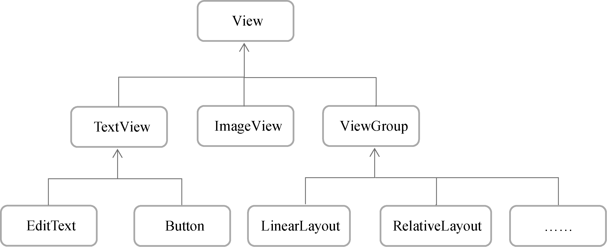

# 软件也要拼脸蛋，UI 开发的点点滴滴

## 该如何编写程序界面

1. 通过 XML 编写程序界面：不仅能够了解界面背后的实现原理，而且编写出来的界面还可以具备很好的屏幕适配性。
2. `ConstraintLayout（约束布局）`：不是非常适合通过编写 XML 的方式开发界面，而是更加适合在可视化编辑器中使用拖放控件的方式来进行操作。

**NOTE：官方更加推荐使用`ConstraintLayout`来开发程序界面。**

## 常用控件的使用方法

### TextView

主要用于在界面上显式一段文本信息。

```xml
<LinearLayout xmlns:android="http://schemas.android.com/apk/res/android"
    android:orientation="vertical"
    android:layout_width="match_parent"
    android:layout_height="match_parent">

    <TextView
        android:id="@+id/textView"
        android:layout_width="match_parent"
        android:layout_height="wrap_content"
        android:text="This is TextView"/>

</LinearLayout>
```

- `android:id`：定义唯一标识符；
- `android:layout_width`和`android:layout_height`： 控件宽度和高度；
  - `match_parent`：当前控件大小和父布局的大小一样，父布局决定当前控件大小；
  - `wrap_content`：当前控件大小刚好包含住内容，控件内容决定当前控件的大小；
  - 固定值：给控件指定一个固定的尺寸，单位一般用`dp`，一种屏幕密度无关的单位，保证在不同分辨率的手机上显式效果尽可能一致。
- `android:gravity`：文字对齐方式，可选值有`top`，`bottom`，`start`，`end`，`center` 等，可以用`|`来同时指定多个值，如`center_vertical|center_horizontal`，表示文字在垂直和水平方向都居中对齐；
- `android:textColor`：指定文字的颜色；
- `android:textSize`：指定文字大小
  - `sp`：用户在系统中修改了文字显式尺寸时，应用程序中的文字大小也会跟着变化
- 其他属性参考文档

### Button

用于和用户交互的一个重要控件

```xml
<LinearLayout xmlns:android="http://schemas.android.com/apk/res/android"
    android:orientation="vertical"
    android:layout_width="match_parent"
    android:layout_height="match_parent">

    <Button
        android:id="@+id/button"
        android:layout_width="match_parent"
        android:layout_height="wrap_content"
        android:text="Button" />

</LinearLayout>
```

使用函数式 API 注册按钮点击事件监听

```kotlin
class MainActivity: AppCompatActivity() {

  override fun onCreate(savedInstanceState: Bundle?) {
    super.onCreate(savedInstanceState)
    setContentView(R.layout.activity_main)
    button.setOnClickListener {
      // do something
    }
  }

}
```

使用实现接口的方式注册点击事件

实现 `View.OnClickListener`接口，并重写`onClick()`方法。

```kotlin
class MainActivity : AppCompatActivity(), View.OnClickListener {

  override fun onCreate(savedInstanceState: Bundle?) {
    super.onCreate(savedInstanceState)
    setContentView(R.layout.activity_main)
    button.setOnClickListener(this)
  }

  override fun onClick(v: View?) {
    when(v?.id) {
      R.id.button -> {
        // do something
      }
    }
  }

}
```

### EditText

相当于`<input>`，它允许用户在控件中输入和编辑内容，并可以在程序中对这些内容进行处理。

```xml
<LinearLayout xmlns:android="http://schemas.android.com/apk/res/android"
    android:orientation="vertical"
    android:layout_width="match_parent"
    android:layout_height="match_parent">

    <EditText
        android:id="@+id/editText"
        android:layout_width="match_parent"
        android:layout_height="wrap_content"
        />

</LinearLayout>
```

### ImageView

用于在界面展示图片的控件。

```xml
<LinearLayout xmlns:android="http://schemas.android.com/apk/res/android"
    android:orientation="vertical"
    android:layout_width="match_parent"
    android:layout_height="match_parent">

    <ImageView
        android:id="@+id/imageView"
        android:layout_width="wrap_content"
        android:layout_height="wrap_content"
        android:src="@drawable/img_1"
        />

</LinearLayout>
```

使用`android:src`属性给`ImageView`指定一张图片。

使用程序动态设置图片

```kotlin
imageView.setImageResource(R.drawable.img_2)
```

### ProgressBar

用于在界面上显示一个进度条，表示程序正在加载一些数据。

```xml
<LinearLayout xmlns:android="http://schemas.android.com/apk/res/android"
    android:orientation="vertical"
    android:layout_width="match_parent"
    android:layout_height="match_parent">

    <ProgressBar
        android:id="@+id/progressBar"
        android:layout_width="match_parent"
        android:layout_height="wrap_content"
        />

</LinearLayout>
```

所有的 Android 控件有具有 `android:visibility` 属性，用于设置控件是否可见，有 3 种可选值：

- `visible`：表示控件可见；
- `invisible`： 表示控件不可见，但是仍然占据着原来的位置和大小，可以理解为控件变成透明状态；
- `gone`：表示控件不仅不可见，而且不再占用任何屏幕控件。

可以通过代码来设置控件的可见性

```kotlin
if (progressBar.visibility == View.VISIBLE) {
  progressBar.visibility = View.GONE
} else {
  progressBar.visibility = View.VISIBLE
}
```

通过`style`属性可以将圆形进度条修改为水平进度条：

```xml
<LinearLayout xmlns:android="http://schemas.android.com/apk/res/android"
    android:orientation="vertical"
    android:layout_width="match_parent"
    android:layout_height="match_parent">

    <ProgressBar
        android:id="@+id/progressBar"
        android:layout_width="match_parent"
        android:layout_height="wrap_content"
        style="?android:attr/progressBarStyleHorizontal"
        android:max="100"
        />

</LinearLayout>
```

通过`android:max`属性给进度条设置一个最大值，然后再代码种动态地更改进度条的进度。

```kotlin
progressBar.progress = progressBar.progress + 10
```

### AlertDialog

`AlertDialog` 可以再当前界面出一个对话框，这个对话框时置顶于所有界面元素之上的，能够屏蔽其他控件的交互能力。

`AlertDialog` 一般用于提示一些非常重要的内容或者警告信息。比如为了防止用户误删重要内容，再删除前弹出一个确认对话框。

```kotlin
AlertDialog.Builder(this).apply {
  // 设置标题
  setTitle("This is Dialog")

  // 设置内容
  setMessage("Something important")

  // 可否使用Back键关闭对话框
  setCancelable(false)

  // 确定按钮点击事件
  setPositiveButton("OK") { dialog, which ->
  }

  // 取消按钮点击事件
  setNegativeButton("Cancel") { dialog, which ->
  }

  // 显示对话框
  show()
}
```

## 基本布局

布局时一种可用于放置很多控件的容器，它可以按照一定的规律调整内部控件的位置，从而编写出精美的界面。

布局内部除了放置控件外，也可以放置布局，通过多层布局的嵌套，能够完成一些比较复杂的界面实现。


### LinearLayout

`LinearLayout`又称作线性布局，是一种非常常用的布局。这个布局会将它所包含的控件再线性方向上一次排列。

通过`android:orientation`属性指定排列方向：

- `vertical`：垂直方向上排列；
- `horizontal`：水平方向上排列。

**Note：** 如果 `LinearLayout` 的排列方向是`horizontal`，内部的控件绝对不能指定为`match_parent`，否则单独一个控件将会将整个水平方向占满，其他控件就没有可放置的位置了。同理，如果方向是`vertical`，内部的控件就不能将高度指定为`match_parent`。

`android:layout_gravity` 用于指定控件在布局中的对齐方式。当`LinearLayout`的排列方向是`horizontal`是，只有垂直方向上的对齐方式才会生效，因为此时水平方向上的长度不固定，每添加一个控件，水平方向上的长度都会改变，因而无法指定该方向上的对齐方式；同理，当`LinearLayout`的排列方向是`vertical`时，只有水平方向上的对齐方式才会生效。

`android:layout_weight` 使用比例的方式来指定控件的大小，在手机屏幕适配性方面可以起到非常重要的作用。类似 css 中的`flex:1`

### RelativeLayout

`RelativeLayout` 又称作相对布局，通过相对定位的方式让控件出现在布局的任何位置。

- `android:layout_above`： 将该控件的底部至于给定 ID 的控件之上,但不会左对齐，默认置于父窗口最左边，会覆盖最左边的控件；
- `android:layout_below`： 将该控件的顶部至于给定 ID 的控件之下,但不会左对齐，默认置于父窗口最左边，会覆盖最左边的控件；
- `android:layout_toLeftOf`： 将该控件的右边缘和给定 ID 的控件的左边缘对齐，默认置于父窗口最上面，会覆盖最上面的控件；
- `android:layout_toRightOf`： 将该控件的左边缘和给定 ID 的控件的右边缘对齐，默认置于父窗口最上面，会覆盖最上面的控件；
- `android:alignParentBottom`： 如果该值为 true，则将该控件的底部和父控件的底部对齐，默认置于父窗口最左下，会覆盖最左下的控件；
- `android:layout_alignParentStart`： 如果该值为 true，则将该控件的左边与父控件的左边对齐，默认置于父窗口最左上，会覆盖最左上的控件；
- `android:layout_alignParentEnd`： 如果该值为 true，则将该控件的右边与父控件的右边对齐，默认置于父窗口最右上，会覆盖最右上的控件；
- `android:layout_alignParentTop`： 如果该值为 true，则将控件的顶部与父控件的顶部对齐，默认置于父窗口最左上，会覆盖最左上的控件；
- `android:layout_alignBaseline`： 该控件的 baseline 和给定 ID 的控件的 baseline 对齐，并置于父窗口最左边，会覆盖最左边的控件；
- `android:layout_alignBottom`： 将该控件的底部边缘与给定 ID 控件的底部边缘对齐，并置于父窗口最左边，会覆盖最左边的控件；
- `android:layout_alignStart`： 将该控件的左边缘与给定 ID 控件的左边缘对齐，并置于父窗口最上边，会覆盖最上边的控件；
- `android:layout_alignRight`： 将该控件的右边缘与给定 ID 控件的右边缘对齐，并置于父窗口最上边，会覆盖最上边的控件；
- `android:layout_alignTop`： 将给定控件的顶部边缘与给定 ID 控件的顶部对齐，并置于父窗口最左边，会覆盖最左边的控件。

### FragmentLayout

`FragmentLayout`又称作帧布局，这种布局没有丰富的定位方式，所有的控件都会默认摆放在布局的左上角。

`FragmentLayout`的应用场景相对偏少一些。

## 自定义控件



`View` 是 Android 中最基本的一种 UI 组件，它可以在屏幕上绘制一块矩形区域，并能响应这块区域的各种事件。各种控件就是在`View`的基础上又添加了各自特有的功能。

`ViewGroup`是一种特殊的`View`，它可以包好很多子`View`和子`ViewGroup`，是一个放置控件和布局的容器。

通过继承或间接继承`View`来实现自定义控件。

两种方式使用自定义控件：

1. 在 Activity 的 xml 文件中使用 `<include>` 来引入布局，这种方式无法响应事件或者其他操作。

   ```xml
    <include layout="@layout/title" />
   ```

2. 给自定义组件编写控件类

   ```kotlin
   // 布局中引入TitleLayout控件时会调用构造函数
    class TitleLayout(context: Context, attrs: AttributeSet) : LinearLayout(context, attrs) {
      init {
        // 动态加载布局文件
        // inflate 参数
        // 第一个参数是要加载的布局文件的id
        // 第二个参数是给加载好的布局再添加一个父布局
        LayoutInflater.from(context).inflate(R.layout.title, this)

        // 执行一些其他操作，比如绑定事件等等
      }
    }
   ```

   在 xml 中引入布局

   ```xml
    <com.example.app.TitleLayout />
   ```

## `ListView`

`ListView` 允许用户通过滑动的方式将屏幕外的数据滚动到屏幕内，同时屏幕上原有的数据会滚动出屏幕。

`ListView` 的简单用法：

```xml
<LinearLayout xmlns:android="http://schemas.android.com/apk/res/android"
    android:layout_width="match_parent"
    android:layout_height="match_parent">

    <ListView
        android:id="@+id/listView"
        android:layout_width="match_parent"
        android:layout_height="match_parent" />

</LinearLayout>
```

```kotlin
override fun onCreate(savedInstance: Bundle?) {
  super.onCreate(savedInstance)
  setContentView(R.layout.activity_main)
  val adapter = ArrayAdapter<String>(this, android.R.layout.simple_lis_item_1, data)
  listView.adapter = adapter
}
```

集合中的数据无法直接传递给`ListView`，需要借助`Adapter`适配器来完成。通过调用`ListView`的`setAdapter()`方法将构建好的适配器对象传入，这样`ListView`和数据之间的关系就建立完成了。

`ArrayAdapter(activity, listViewItemResourceId, data)` 是其中一中适配器：

- `activity`：activity 实例
- `listViewItemResourceId`：ListView 子项布局 id
- `data`：要显示的数据源

自定义适配器

```kotlin
代码如下所示：

class FruitAdapter(activity: Activity, val resourceId: Int, data: List<Fruit>) :
        ArrayAdapter<Fruit>(activity, resourceId, data) {

    override fun getView(position: Int, convertView: View?, parent: ViewGroup): View {
        //  加载子项布局
        val view = LayoutInflater.from(context).inflate(resourceId, parent, false)
        val fruitImage: ImageView = view.findViewById(R.id.fruitImage)
        val fruitName: TextView = view.findViewById(R.id.fruitName)
        val fruit = getItem(position) // 获取当前项的Fruit实例
        if (fruit != null) {
            fruitImage.setImageResource(fruit.imageId)
            fruitName.text = fruit.name
        }
        return view
    }

}

override fun onCreate(savedInstanceState: Bundle?) {
        super.onCreate(savedInstanceState)
        setContentView(R.layout.activity_main)
        initFruits() // 初始化水果数据
        val adapter = FruitAdapter(this, R.layout.fruit_item, fruitList)
        listView.adapter = adapter
    }
```

`getView()`方法在每个子项滚动到屏幕内的时候会被调用。

`getView()`方法中的`convertView`参数是将之前加载好的布局进行缓存，以便后面进行重用。如果不使用这个参数，那么每次子项滚动到屏幕，调用`getView()`方法时都会重新加载一遍布局。

```kotlin
class FruitAdapter(activity: Activity, val resourceId: Int, data: List<Fruit>) :
        ArrayAdapter<Fruit>(activity, resourceId, data) {

    override fun getView(position: Int, convertView: View?, parent: ViewGroup): View {
        val view: View
        if (convertView == null) {
            view = LayoutInflater.from(context).inflate(resourceId, parent, false)
        } else {
            view = convertView
        }
        val fruitImage: ImageView = view.findViewById(R.id.fruitImage)
        val fruitName: TextView = view.findViewById(R.id.fruitName)
        val fruit = getItem(position) // 获取当前项的Fruit实例
        if (fruit != null) {
            fruitImage.setImageResource(fruit.imageId)
            fruitName.text = fruit.name
        }
        return view
    }

}
```

通过`ViewHolder`缓存布局中的控件进一步优化性能

```kotlin
class FruitAdapter(activity: Activity, val resourceId: Int, data: List<Fruit>) :
        ArrayAdapter<Fruit>(activity, resourceId, data) {

    inner class ViewHolder(val fruitImage: ImageView, val fruitName: TextView)

    override fun getView(position: Int, convertView: View?, parent: ViewGroup): View {
        val view: View
        val viewHolder: ViewHolder
        if (convertView == null) {
            view = LayoutInflater.from(context).inflate(resourceId, parent, false)
            val fruitImage: ImageView = view.findViewById(R.id.fruitImage)
            val fruitName: TextView = view.findViewById(R.id.fruitName)
            viewHolder = ViewHolder(fruitImage, fruitName)
            view.tag = viewHolder
        } else {
            view = convertView
            viewHolder = view.tag as ViewHolder
        }

        val fruit = getItem(position) // 获取当前项的Fruit实例
        if (fruit != null) {
            viewHolder.fruitImage.setImageResource(fruit.imageId)
            viewHolder.fruitName.text = fruit.name
        }
        return view
    }

}
```

`ListView`点击事件。当用户点击了`ListView`中的任何一个子项时会调用。

```kotlin
listView.setOnItemClickListener { parent, view, position, id ->
    val fruit = fruitList[position]
    Toast.makeText(this, fruit.name, Toast.LENGTH_SHORT).show()
}

// 未使用参数可以使用下划线来替代
listView.setOnItemClickListener { _, _, position, _ ->
    val fruit = fruitList[position]
    Toast.makeText(this, fruit.name, Toast.LENGTH_SHORT).show()
}
```

## `RecyclerView`

`RecyclerView`是一个增强版的`ListView`，不仅可以轻松实现和`ListView`同样的效果，还优化了`ListView`存在的各种不足之处。

Android 官方推荐使用`RecyclerView`。

### 基本用法

添加依赖

```groovy
dependencies {
    ...
    implementation 'androidx.recyclerview:recyclerview:1.0.0'
}
```

布局中加入`RecyclerView`控件

```xml
<LinearLayout xmlns:android="http://schemas.android.com/apk/res/android"
    android:layout_width="match_parent"
    android:layout_height="match_parent">

    <androidx.recyclerview.widget.RecyclerView
        android:id="@+id/recyclerView"
        android:layout_width="match_parent"
        android:layout_height="match_parent" />

</LinearLayout>
```

适配器

```kotlin
class FruitAdapter(val fruitList: List<Fruit>) :
        RecyclerView.Adapter<FruitAdapter.ViewHolder>() {

    inner class ViewHolder(view: View) : RecyclerView.ViewHolder(view) {
        val fruitImage: ImageView = view.findViewById(R.id.fruitImage)
        val fruitName: TextView = view.findViewById(R.id.fruitName)
    }

    // 加载子项布局文件，并创建ViewHolder实例
    override fun onCreateViewHolder(parent: ViewGroup, viewType: Int): ViewHolder {
        val view = LayoutInflater.from(parent.context)
        .inflate(R.layout.fruit_item, parent, false)
        return ViewHolder(view)
    }

    // 对RecyclerView子项数据进行赋值，该方法会在每个子项滚动到屏幕内执行
    override fun onBindViewHolder(holder: ViewHolder, position: Int) {
        val fruit = fruitList[position]
        holder.fruitImage.setImageResource(fruit.imageId)
        holder.fruitName.text = fruit.name
    }

    // RecyclerView 一共有多少个子项
    override fun getItemCount() = fruitList.size

}

override fun onCreate(savedInstanceState: Bundle?) {
    super.onCreate(savedInstanceState)
    setContentView(R.layout.activity_main)
    initFruits() // 初始化水果数据
    val layoutManager = LinearLayoutManager(this)
    recyclerView.layoutManager = layoutManager
    val adapter = FruitAdapter(fruitList)
    recyclerView.adapter = adapter
}
```

通过`LayoutManager`来指定`RecyclerView`的布局方式

- `LinearLayoutManager`：线性布局

  - `LinearLayoutManager.HORIZONTAL`：水平方向
  - `LinearLayoutManager.VERTICAL`：垂直方向

- `GridLayoutManager`：网格布局
- `StaggeredGridManager`：瀑布流布局，`StaggeredGridManager(3, StaggeredGridManager.VERTICAL)`
  - 第一个参数指定布局的列数
  - 第二个参数指定布局的排列方式

点击事件

`RecyclerView`可以轻松实现子项中任意控件或布局的点击事件，而`ListView`只能实现子项的点击事件，子项中的某一个控件的点击事件实现起来就相对比较麻烦。

```kotlin
override fun onCreateViewHolder(parent: ViewGroup, viewType: Int): ViewHolder {
    val view = LayoutInflater.from(parent.context)
    .inflate(R.layout.fruit_item, parent, false)
    val viewHolder = ViewHolder(view)
    // itemView 表示最外层布局
    viewHolder.itemView.setOnClickListener {
        val position = viewHolder.adapterPosition
        val fruit = fruitList[position]
        Toast.makeText(parent.context, "you clicked view ${fruit.name}",
            Toast.LENGTH_SHORT).show()
    }
    viewHolder.fruitImage.setOnClickListener {
        val position = viewHolder.adapterPosition
        val fruit = fruitList[position]
        Toast.makeText(parent.context, "you clicked image ${fruit.name}",
            Toast.LENGTH_SHORT).show()
    }
    return viewHolder
}
```
