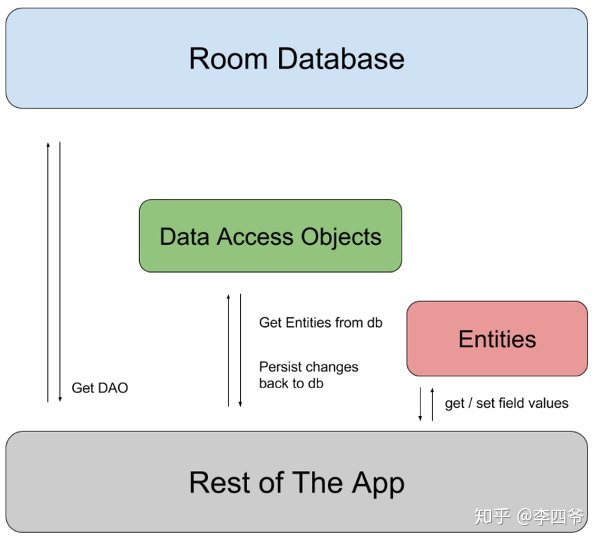

# 使用 Room 操作数据库

Room 持久性库在 SQLite 上提供了一个抽象层，以便在充分利用 SQLite 的强大功能的同时，能够流畅地访问数据库。

## 优势

- 针对 SQL 查询的编译时验证
- 可最大限度减少重复和容易出错的样板代码（注解）
- 简化了数据库的迁移路径

## 依赖

```groovy
dependencies {
  def room_version = '2.4.3'

  implementation "androidx.room:room-runtime:$room_version"

  // For Kotlin use kapt instead of annotationProcessor (注意这个注释)
  kapt "androidx:room:room-compiler:$room_version"

}
```

## 主要组件

Room 包含三个主要组件：

- Entity：实体类，对用的是数据库的一张表结构。需要使用注解`@Entity`标记；
- Dao：数据访问对象，包含一些列访问数据的方法。需要使用注解`@Dao`标记；
- Database：数据库持有者，作为与应用持久化相关数据的底层连接的主要接入点。需要使用`@Database`标记，但是需要满足一下条件：
  - 定义的类必须是一个继承于`RoomDatabase`的 抽象类；
  - 在注解中需要定义与数据库相关联的实体类列表；
  - 包含一个没有参数的抽象方法并返回一个带有注解的`@Dao`。



## 数据实体：@Entity

数据实体表示要存储的对象，每个实体都对应于数据库中的一张表，并且实体的每个实例都表示相应表中的一行数据。

默认情况下，Room 将类名作为数据库名称，将字段名作为数据库中的列名称。

- `@Entity`注解中可以传入`tableName`用来指定表的名称。
- `@PrimaryKey`：标注表的主键，传入`autoGenerate`来指定主键是否自增长：`@PrimaryKey(autoGenerate = true)`。
- `@ColumnInfo`：标注对应列的信息，比如列名，默认值等等。

```kotlin
@Entity(tableName = "users")
data class User(
  @PrimaryKey val id: Int,
  @ColumnInfo(name = "first_name") val firstName: String?,
  val lastName: String?,
)
```

## 数据访问对象：@Dao

通过定义数据访问对象（DAO）与存储的数据进行交互。每个 DAO 都包含一些方法，这些方法提供对应用数据库的抽象访问权限。在编译时，Room 会自动生成 DAO 的实现。（关注点分离）

DAO 一般被定义为一个*接口*或一个*抽象类*。
DAO 不具有属性，但是定义了一个或多个方法，用于与数据库中的数据进行交互。

```kotlin
@Dao
interface UserDao {
  // 插入数据
  // vararg: 可变参数
  @Insert
  fun insertAll(vararg users: User)

  // 删除
  @Delete
  fun delete(user: User)

  // 查询
  @Query("SELECT * FROM user")
  fun getAll(): List<User>
}
```

便捷方法：

- `@Insert(entity: KClass<*>, onConflict: Int)`：插入数据；
  - `entity`：要插入的实体，默认值为传入方法的参数，如：`User::class`；
  - `onConflict`：发生冲突时的处理方式，默认值未`OnConflictStrategy.ABORT`, 如：`OnConflictStrategy.REPLACE`。
- `@Update(entity: KClass<*>, onConflict: Int)`：更新数据库表中特定行，Room 使用主键将传入的实体实例与数据库中的进行匹配。如果没有具有相同主键的行，Room 不会进行任何更改；
- `@Delete(entity: KClass<*>)`：从数据库中删除特定行，Room 使用主键将传入的实体实例与数据库中的进行匹配。如果没有具有相同主键的行，Room 不会进行任何更改；
- `@Query`：使用简单的`SELECT`查询返回数据库中的数据。
  - 将简单参数传递给查询：
  ```kotlin
  @Query("SELECT * FROM user WHERE age > :minAge")
  fun loadAllUsersOlderThen(minAge: Int): Array<User>
  ```
  - 将一组参数传递给查询
  ```kotlin
  @Query("SELECT * FROM user WHERE region IN (:regions)")
  fun loadUsersFromRegions(regions: List<String>): List<User>
  ```
  - 查询多个表
  ```kotlin
  @Query(
    "SELECT * FROM book " +
    "INNER JOIN loan ON loan.book_id = book.id " +
    "INNER JOIN user ON user.id = loan.user_id " +
    "WHERE user.name LIKE :userName"
  )
  fun findBooksBorrowedByNameSync(userName: String): List<Book>
  ```
  - 多重映射
  ```kotlin
  @Query(
    "SELECT * FROM user" +
    "JOIN book ON user.id = book.user_id"
  )
  fun loadUserAndBookNames(): Map<User, List<Book>>
  ```

分页：
Room 通过与 `Paging库`继承来支持分页查询（后面深入）

## 数据库: @Database

数据库类必须满足一下条件：

- 该类必须带有`@Database`注解，该注解包含列出所有与数据关联的数据实体的`entities`数组；
- 该类必须时一个抽象类，用于扩展`RoomDatabase`；
- 对于与数据库关联的每个 DAO 类，数据库类必须定义一个具有零参数的抽象方法，并返回 DAO 类的实例。

> 注意：如果您的应用在单个进程中运行，在实例化 AppDatabase 对象时应遵循单例设计模式。每个 RoomDatabase 实例的成本相当高，而您几乎不需要在单个进程中访问多个实例。如果您的应用在多个进程中运行，请在数据库构建器调用中包含 enableMultiInstanceInvalidation()。这样，如果您在每个进程中都有一个 AppDatabase 实例，可以在一个进程中使共享数据库文件失效，并且这种失效会自动传播到其他进程中 AppDatabase 的实例。

```kotlin
@Database(entities = [User::class], version = 1)
abstract class AppDatabase : RoomDatabase() {
    abstract fun userDao(): UserDao
}

// 创建数据库实例
val db = Room.databaseBuilder(
            applicationContext,
            AppDatabase::class.java, "database-name"
        ).build()
```
