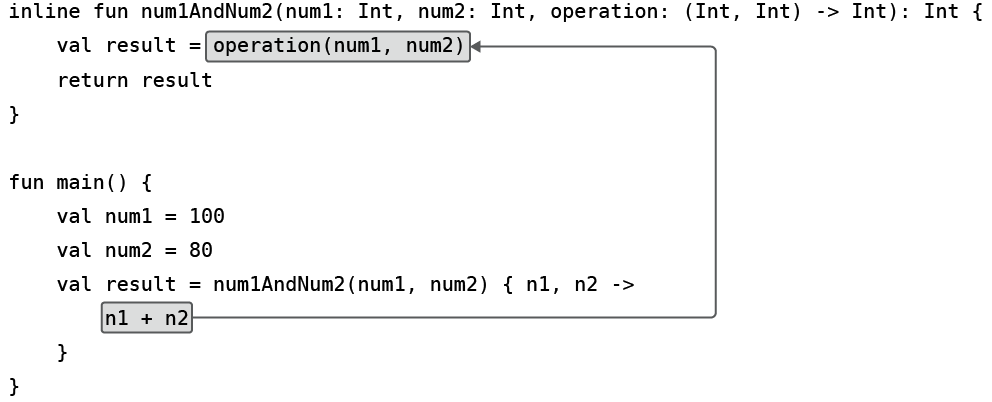
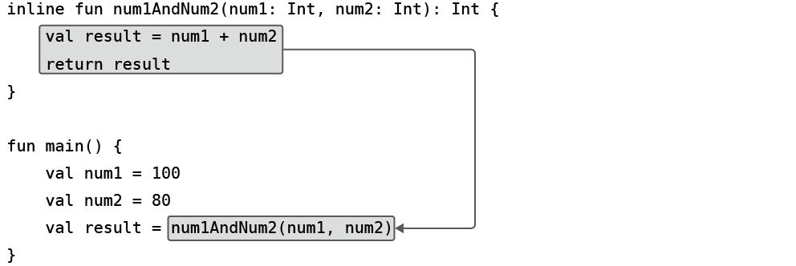
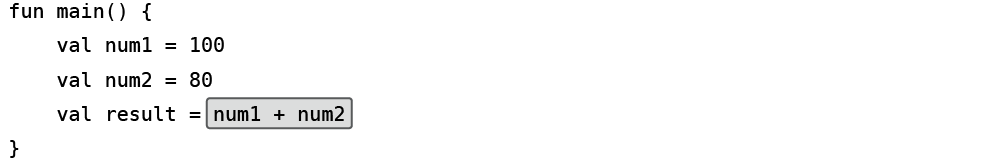
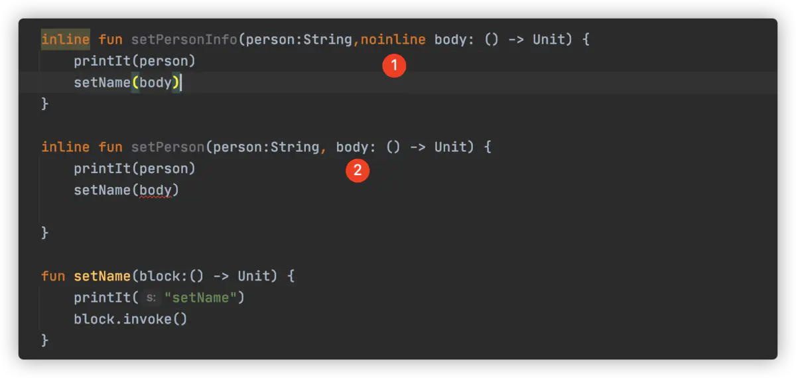
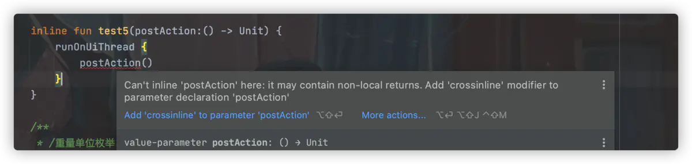
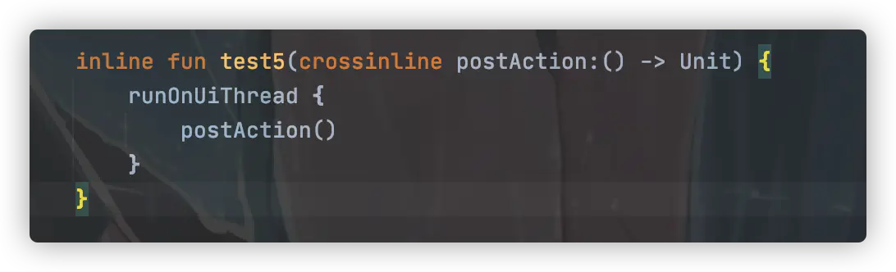

# 高阶函数

## 定义

如果一个函数接收另一个函数作为参数，或者返回另一个函数，那么改函数就被成为高阶函数。

```kotlin
fun example(func: (String, Int) -> Unit) {
  func("Hello", 123)
}
```

高阶函数允许让函数类型的参数来界定函数的执行逻辑。
同一个高阶函数，只要传入不同类型的函数，那么它的执行逻辑和最终的返回结果可能是完全不同的。

```kotlin
fun num1AndNum2(a: Int, b: Int, operation: (Int, Int) -> Int): Int {
  val result = operation(a, b)
  return result
}

fun plus(a: Int, b: Int): Int {
  return a + b
}

fun minus(a: Int, b: Int): Int {
  return a - b
}

fun main() {
  val a = 100
  val b = 80
  // ::plus 函数引用
  val result1 = num1AndNum2(a, b, ::plus)
  val result2 = num1AndNum2(a, b, ::minus)

  // Lambda表达式
  val result1 = num1AndNum2(a, b) { a, b ->
    a + b
  }

  val result2 = num1AndNum2(a, b) { a, b ->
    a - b
  }
}
```

给 Lambda 表达式指定上下文

高阶函数中，在函数类型的情面加上`ClassName.`表示这个函数类型是定义在哪个类当中的。这样当调用高阶函数时，传入的 Lambda 表达式就会自动拥有`ClassName`的上下文。

```kotlin
fun StringBuilder.build(block: StringBuilder.() -> Unit): StringBuilder {
  block()
  return this
}

fun main() {
  val list = listOf("Apple", "Banana", "Orange", "Pear", "Grape")
  val result = StringBuilder().build {
    append("Start eating fruits.\n")
    for (fruit in list) {
      append(fruit).append("\n")
    }
    append("Ate all fruits")
  }
  println(result.toString())
}
```

## 高阶函数实现原理

Kotlin 编译器会将高阶函数的语法转换成 Java 支持的语法结构

```kotlin
fun num1AndNum2(a: Int, b: Int, operation: (Int, Int) -> Int): Int {
  val result = operation(a, b)
  return result
}

fun main() {
  val a = 100
  val b = 80
  val result = num1AndNum2(a, b) { n1, n2 ->
    n1 + n2
  }
}
```

上述 Kotlin 代码大致转换为如下 Java 代码：

```java
public static int num1AndNum2(int a, int b, Function operation) {
  int result = (int) operation.invoke(a, b);
  return result;
}

public static void main() {
  int a = 100;
  int b = 80;
  int result = num1AndNum2(a, b, new Function() {
    @Override
    public Integer invoke(Integer n1, Integer n2) {
      return n1 + n2
    }
  })
}
```

Lambda 表达式在底层被转换成了匿名类的实现方式。

每调用一次 Lambda 表达式，都会创建一个新的匿名类实例，造成了额外的内存和性能开销。

## 内联函数

定义高阶函数时加上`inline`关键字声明一个内联函数。

内联函数可以消除使用 Lambda 表达式带来的运行时开销

```kotlin
inline fun num1AndNum2(a: Int, b: Int, operation: (Int, Int) -> Int): Int {
  val result = operation(a, b)
  return result
}
```

内联函数工作原理：Kotlin 编译器会将内联函数中的代码在编译时自动替换到调用它的地方。

首先，Kotlin 编译器会将 Lambda 表达式中的代码替换到函数类型参数调用的地方：

接下来，再将内联函数中的全部代码替换到函数调用的地方：

最终代码被替换成如下图所示：


**内联的函数类型参数**在编译时会被替换，因此它没有真正的参数属性。

**内联的函数类型参数**只允许传递给另外一个内联函数。

**内联函数**所引用的 Lambda 表达式中可以使用`return`关键字进行函数返回，非内联函数只能进行局部返回，`return@函数名`

```kotlin
fun printStr(str: String, block: (String) -> Unit) {
  println("printStr begin")
  block(str)
  println("printStr end")
}

fun main() {
  println("main start")
  val str = ""
  printStr(str) { s ->
    println("lambda start")
    if (s.isEmpty()) return@printStr
    println(s)
    println("lambda end")
  }
  println("main end")
}

// 局部返回
// 输出
// main start
// printStr begin
// lambda start
// printStr end
// main end
```

```kotlin
inline fun printStr(str: String,  block: (String) -> Unit) {
  println("printStr begin")
  block(str)
  println("printStr end")
}

fun main() {
    println("main start")
    val str = ""
    printString(str) { s ->
        println("lambda start")
        if (s.isEmpty()) return
        println(s)
        println("lambda end")
    }
    println("main end")
}

// 输出
// main start
// printStr begin
// lambda start
```

## noinline 与 crossinline

### noinline 禁止内联

如果希望只内联一部分传给内联函数的 lambda 表达式函数，那么可以用 `noinline` 标记不希望内联的函数参数。

因为**内联函数「函数参数」不允许作为参数传递给非内联函数**， 如果要正常使用，需要把内联取消掉，当成一个普通的参数传递过去。



### crossinline

局部加强内联优化，让内联函数里的函数类型参数可以间接被调用，代价是不能在 lambda 表达式里使用 return，用于参数。



